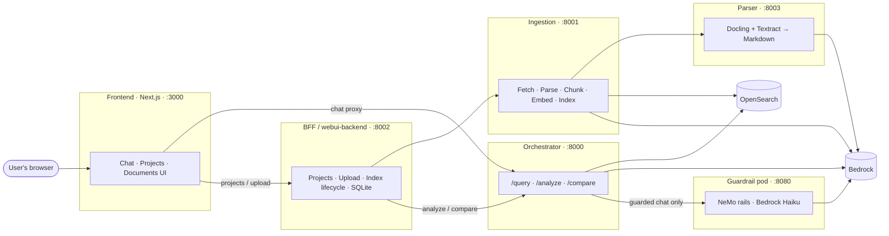
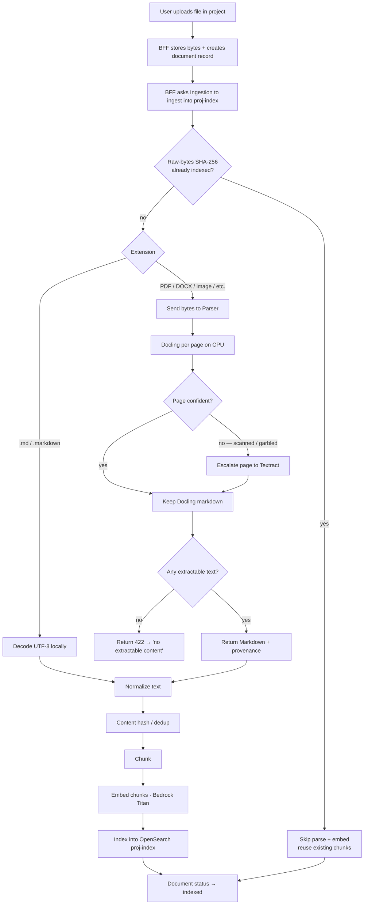
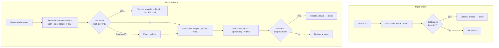
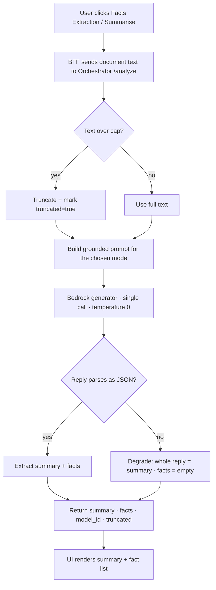
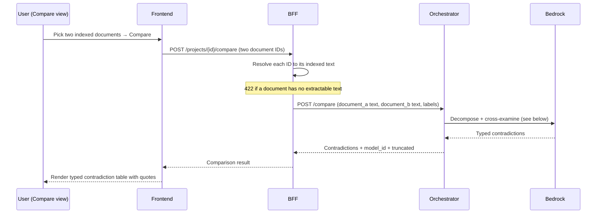
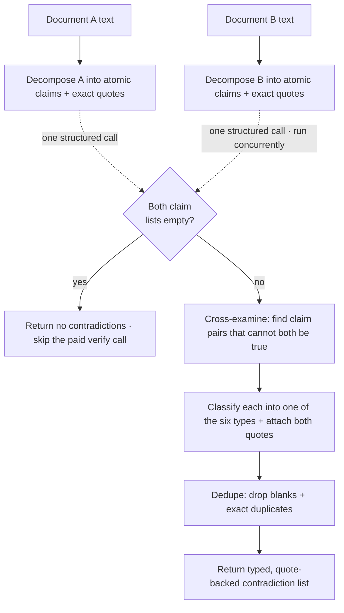

# Crucible — Document Features Guide

A careful, code-free walkthrough of the four document-centric capabilities in the
Crucible legal-RAG platform:

1. **Document Ingestion & Parsing** — how an uploaded file becomes searchable text.
2. **Guardrails** — how chat answers are kept safe and grounded.
3. **Fact Extraction** — how a single document is distilled into a summary + facts.
4. **Document Comparison** — how two documents are cross-examined for contradictions.

Each section explains *what happens* and *why*, with a Mermaid process diagram
rather than code, and — where useful — the relevant service tree. Three short
screen-capture clips are linked in-place.

---

## The service landscape at a glance

Every capability is delivered by a small set of independent services that talk to
each other **over HTTP only** (never by importing each other's code — the
"dependency firewall"). All model calls go to **AWS Bedrock** in `ap-southeast-2`;
nothing leaves that region.



> **Reading the map.** The browser reaches the orchestrator only through the
> frontend's server-side proxy, and reaches the BFF directly. The BFF owns
> projects and uploads but runs no models itself — it forwards work to ingestion
> (for indexing) and to the orchestrator (for analyze/compare). The parser and
> guardrail pod are **east-west only**: never exposed to the public internet.

---

## 1. Document Ingestion & Parsing

### What it does

When a user uploads a file into a project, Crucible turns those raw bytes into
**clean, chunked, embedded, searchable text** stored in that project's private
OpenSearch index. Only after this completes does the document show as `indexed`
and become usable for chat, fact extraction, and comparison.

Two services collaborate:

- **Ingestion** owns the whole pipeline and the "never index nothing" contract.
- **Parser** is a specialist that converts non-Markdown formats (PDF, scanned
  images, DOCX, XLSX, HTML) into Markdown. Ingestion calls it over HTTP and never
  imports it, so the heavy Docling/Torch stack stays entirely on the parser side.

### How a file is parsed (the two routes)

The file extension decides the route:

- **`.md` / `.markdown`** → decoded locally as UTF-8. No round-trip to the parser.
- **everything else** → sent to the parser, which returns Markdown.

Inside the parser, each page is first attempted with **Docling on CPU**. Pages
that come back low-confidence (scanned, garbled, form-heavy) are **escalated
per-page to AWS Textract** (the default engine — chosen because it is
*deterministic*, so re-parsing a page yields identical text and dedup stays
predictable). Digital PDFs, DOCX, XLSX and HTML parse **offline**; only the
troublesome pages cost a Textract call.

The parser is **verdict-honest about failure**: a document with no extractable
content (e.g. a photo with no text) returns a typed **422**, which ingestion maps
onto its own "refuse to index nothing" 422 — never a silent empty index.

### The cost-saving gate

Before paying for any parsing, ingestion hashes the **raw upload bytes**
(`raw_sha256`) and checks OpenSearch for that exact hash. An identical re-upload
**short-circuits the entire parse + embed cost**. (Note: this only suppresses
*identical raw files* — it does not suppress a re-ingest caused by changing the
*extraction method*, because that changes the parsed output, not the input bytes.)

### The end-to-end flow



> **Streaming progress.** The ingest endpoint streams progress back to the UI as
> Server-Sent Events. When the parser is used it emits one frame per page, and
> ingestion re-emits that as per-page "parsing" progress — a nested stream, so the
> UI can show the document moving through *parsing → chunking → embedding →
> indexing* rather than a frozen spinner.

### Parser service tree

```
services/parser/
├── app/
│   ├── main.py            # FastAPI entry
│   ├── config.py          # PARSER_* settings (page cap, size cap, escalation engine, region)
│   └── api/
│       └── parse.py       # POST /parse (drain) · POST /parse/stream (SSE) · GET /healthz
├── parser_service/        # Vendored parsing engine (the heavy stack lives here)
│   ├── parser_service.py  # Orchestrates the per-page parse
│   ├── markdown_pipeline.py / markdown.py   # Docling → Markdown
│   ├── confidence.py      # Per-page confidence → escalation decision
│   ├── quality_gate.py    # Which pages get promoted to Textract
│   ├── textract_client.py # AWS Textract escalation
│   ├── vlm_client.py      # Optional Bedrock-VLM escalation (non-default)
│   ├── render.py          # Rasterize a page for escalation
│   ├── retry.py           # Transient-error retry policy
│   ├── route_stats.py     # Per-route counters (Docling vs Textract)
│   └── io_layer.py        # Bytes → tempfile for Docling's Path API (no disk leak)
├── scripts/               # Model-bake + offline-startup smoke tests
├── Dockerfile             # Bakes Docling + OCR models for fully-offline runtime
└── README.md
```

> **Design note.** The parser is **S3/IAM-free** — it receives raw bytes over the
> wire and writes them to a context-managed tempfile. It has **no app-level auth**,
> which is safe *only* because it is never internet-exposed: an exposed parser is a
> cost-bomb (arbitrary bytes → billed Textract pages).

### 🎬 Watch: ingesting a document

▶ **Ingestion walkthrough:** https://www.youtube.com/watch?v=424YrGGTTAk

---

## 2. Guardrails

### What it does

Guardrails keep **chat** answers safe and grounded. Every guard *verdict* is owned
by a dedicated out-of-process **NeMo Guardrails pod**, which the orchestrator calls
over HTTP. The pod answers two questions and **only returns a decision** — it never
rewrites the answer:

- **Input check** — *Is this user turn a jailbreak / prompt-injection?*
- **Output check** — *Does this generated answer leak a secret or PII, violate
  policy, or make an ungrounded claim?*

Keeping the pod **verdict-only** (a validator, not a transformer) means a pod bug
can never corrupt or un-redact delivered content, and no NeMo/LangChain types ever
cross into the lean orchestrator.

### The rails pipeline

On the **input** lane a single self-check rail decides jailbreak/injection. On the
**output** lane, a **pure-regex secrets/PII detector runs first and
short-circuits**: a secret or high-severity PII hit blocks the answer *without*
paying for any LLM rail. If it passes, two LLM rails (policy, then grounding) run.



### How the orchestrator uses a verdict

A guard **block is always an honest `200` refusal**, never a `5xx`. The pod's
verdict maps cleanly onto the orchestrator's existing shape:

- `unsafe = true` → the orchestrator returns a canned refusal.
- `flag = true` → advisory: deliver the answer with a note (this is also the
  output-lane *fail-open* signal when Bedrock is unreachable).

### Resilience — failure is designed per-mode

Because one pod now guards everything, its failure behavior is deliberate, not flat:

- **An LLM rail fails but the pod is up** (throttle/error): the deterministic
  secrets/high-PII rail **still blocks** (it's pure regex, no model), while the
  policy and grounding rails **fail open + flag**. The most important protection
  survives the most common failure.
- **The pod is unreachable**: input fails **safe/block**; output fails **open +
  advisory flag**, and the fail-open window is made *loud* (a distinct rule id) —
  never silent.

### Determinism guarantee

"Same config hash ⇒ same guard behavior" must survive the two-service split, so the
pin carries **two hashes**: a digest of the NeMo `config/` directory (rails +
prompts + detector tables) *and* the sha256 of the resolved dependency lockfile. At
startup the pod recomputes both and **refuses to serve on any drift**, so a stale
image can never silently answer under an old pin.

### Guardrail service tree

```
services/guardrail/
├── app/
│   ├── main.py            # FastAPI entry: builds the ONE LLMRails engine + compiles the detector; all error mapping
│   ├── settings.py        # Env-resolved settings; model id + the two expected determinism hashes
│   ├── contract.py        # HTTP contract — plain-data CheckResponse (no NeMo types on the wire)
│   ├── bedrock_engine.py  # Forces the 'langchain' framework so NeMo can reach Bedrock (not OpenAI)
│   ├── detectors.py       # Pure-regex secrets/PII detector (+ Luhn) — the first output rail, no LLM
│   ├── nemo_runtime.py    # Maps a rails verdict → CheckResponse; applies per-rail fail policy
│   ├── config_digest.py   # Computes the two determinism hashes
│   └── routers/
│       ├── check.py       # POST /check/input · POST /check/output
│       └── health.py      # GET /healthz · GET /readyz (fails if the detector didn't compile)
├── config/                # The NeMo config dir — its digest is pinned into the orchestrator's config
│   ├── config.yml         # Models + rail ordering (output: deterministic → policy → facts)
│   ├── prompts.yml        # Self-check rail prompts
│   ├── detectors.yml      # Secrets/PII pattern tables (severity high→block, low→flag)
│   ├── actions.py         # Registers the deterministic scan as a first-class NeMo action
│   └── rails/
│       └── deterministic_output.co   # Colang flow invoking the deterministic action as an output rail
├── scripts/               # Capability walkthrough against a running pod
├── Dockerfile             # Runtime forces NEMOGUARDRAILS_LLM_FRAMEWORK=langchain; serves :8080
└── README.md
```

> **Why a separate pod?** NeMo Guardrails drags in LangChain + `langchain-aws`.
> Hosting it inside the orchestrator would bloat the image and break the
> `stages-pure` import boundary that keeps pipeline stages free of infra imports.
> Isolating it behind an injected client keeps the orchestrator lean *and* lines
> the pod up for its independent-Kubernetes-pod future (its own `/readyz`, its own
> credentials).

### 🎬 Watch: guarded chat

▶ **Chatting walkthrough:** https://www.youtube.com/watch?v=D82eXF2NkaM

---

## 3. Fact Extraction

### What it does

Fact Extraction reads **one document** and returns a **concise summary** and/or a
list of **discrete, explicitly-stated facts** — parties, dates, monetary amounts,
obligations, defined terms, governing law, key clauses. It powers the "Facts
Extraction" and "Summarise" actions in the document detail view.

It runs on the orchestrator's analysis path, which is **non-RAG**: the caller
supplies the document text directly, so there is *no retrieval, no OpenSearch, and
no guardrail lane*. It stays available even when search is down. It is a bounded,
read-only analysis of text the user already owns.

### How it works

The model is run **once** over the (length-capped) text with sampling fixed low for
reproducibility, and is asked for a **strict JSON object**. The result parses
*honestly*: a reply that isn't valid JSON degrades to "summary text, no facts"
rather than erroring — the caller always gets something truthful.



**Three modes:**

| Mode | Produces | Prompt shape |
| --- | --- | --- |
| `facts` | facts only | strict JSON `{facts: [...]}` |
| `summary` | summary only | plain prose (the whole reply is the summary) |
| `both` | summary + facts | strict JSON `{summary, facts: [...]}` |

> **Grounding discipline.** Every prompt begins "Work ONLY from what the document
> actually states — never infer, guess, or add outside knowledge." Facts must be
> *explicitly stated*, one short self-contained sentence each, most-important
> first. This is the same anti-hallucination stance the comparison feature uses.

---

## 4. Document Comparison

### What it does

Document Comparison cross-examines **two** documents and returns every genuine
**contradiction** between them, each classified into one of **six types** and
carrying the *exact conflicting quote from each document* (verbatim, never
paraphrased):

| Type | Example |
| --- | --- |
| **Temporal** | "Starts Jan 15" vs "Starts end of Q1" |
| **Numerical** | "$12M surplus" vs "$5M deficit" |
| **Authority** | "Issued by Compliance Office" vs "Issued by Strategy Unit" |
| **Process** | "Submit via HR portal" vs "Submit through admins" |
| **Policy Reversal** | "Remote work mandatory" vs "Remote work not permitted" |
| **Specificity** | "Applies globally" vs "Applies only to APAC" |

It is reached from the **Compare Documents for Contradiction** button, which opens
a picker where the user selects exactly **two indexed documents**.

### The request path (three hops)



> The BFF turns **document IDs into text** and forwards them; it runs no model
> itself. The orchestrator does the actual reasoning.

### The reasoning: decompose-then-verify

The comparison uses the reusable core of the **CLAIRE** approach (Stanford, EMNLP
2025), adapted for two specific documents rather than a corpus. It is **non-RAG**
(both documents' text is supplied, so it works even when retrieval is down) and
runs in **two model stages** via LangChain, confined to the orchestrator's boundary
router so the pure pipeline stays free of the boto3-pulling LangChain stack.



**Stage 1 — Decompose.** Each document is broken into atomic, self-contained
claims, and *each claim carries its verbatim supporting quote*. The two documents
are decomposed **concurrently** (one structured call each). If both come back with
no substantive claims, the expensive verify call is **skipped** entirely.

**Stage 2 — Cross-examine.** The two claim lists are compared for pairs — one from
A, one from B — that *genuinely cannot both be true* (not mere wording differences
or one-sided detail). Each contradiction is classified and stamped with the exact
conflicting quote from each side.

### Honest degradation vs. real faults

This is the subtle, important part:

- A **parse failure** (the model ran but returned something unschematic) degrades
  to an *empty result* for that stage/document — and in Stage 1 the two documents
  are isolated, so a parse failure on one never discards the other's claims.
- A **real infrastructure fault** (a Bedrock error, a network fault) **propagates**
  as an app-level error. It is *never* swallowed — because swallowing it would
  fabricate a "no contradictions — the documents agree" clean bill of health for a
  comparison that never actually ran. Truncation, likewise, is *reported*
  (`truncated: true`), never silent.

### WebUI service tree (frontend + BFF)

The comparison feature spans both halves of the WebUI service.

```
services/webui/
├── frontend/                         # Next.js UI · :3000
│   └── src/
│       ├── app/                      # Routes + server-side proxy to the orchestrator
│       ├── components/
│       │   ├── projects/
│       │   │   ├── ProjectDetailPanel.tsx     # Hosts the toolbar + the Compare button
│       │   │   ├── CompareDocumentsView.tsx   # Two-doc picker + typed contradiction table
│       │   │   ├── DocumentDetailView.tsx     # Facts Extraction / Summarise actions
│       │   │   └── ... (documents, status badges, project chat)
│       │   ├── chat/                 # Chat view, guardrail chip, markdown answer
│       │   └── sidebar/              # Projects + chat navigation
│       ├── lib/
│       │   ├── bff.ts                # Client for the BFF (projects, upload, compare)
│       │   ├── sse.ts / streamClient.ts   # SSE parsing for streamed chat + ingest
│       │   └── ... (citations, render, config)
│       └── hooks/                    # useReadyz, useAssistantChat
│
└── backend/                          # BFF · :8002 (projects, upload, index lifecycle over SQLite)
    └── app/
        ├── main.py
        ├── api/
        │   ├── projects.py           # Create/list projects + their indices
        │   └── documents.py          # Upload · status · Facts Extraction · Compare routes
        ├── ingest_client.py          # Talks to ingestion (upload → index)
        ├── analyze_client.py         # Talks to orchestrator /analyze (fact extraction)
        ├── compare_client.py         # Talks to orchestrator /compare (contradictions)
        ├── index_client.py           # Per-project index provisioning
        ├── store.py / db.py          # SQLite project + document records
        └── storage.py                # Uploaded bytes on disk
```

> **The firewall shows up here too.** The BFF never imports orchestrator or
> ingestion code — it reaches them exclusively through the small `*_client.py`
> modules over HTTP. Each new capability (analyze, compare) is one client + one
> route, keeping the boundary explicit.

### 🎬 Watch: comparing two documents

▶ **Comparison walkthrough:** https://www.youtube.com/watch?v=ADoGPL6vbao

---

## Cross-cutting themes (why these four feel consistent)

| Theme | How it shows up |
| --- | --- |
| **Dependency firewall** | Services talk HTTP-only; ingestion never imports the parser, the BFF never imports the orchestrator. |
| **Bedrock-only, in-region** | Every model call is AWS Bedrock in `ap-southeast-2`; no data leaves the region; no OpenAI. |
| **Honest degradation** | Parse failures degrade to empty/truthful results; real infra faults propagate — they never masquerade as a clean answer. |
| **Grounding discipline** | Analyze and Compare both instruct the model to use *only* what the document states — never infer. |
| **Verdict-only guarding** | The guardrail pod decides, it never rewrites; a block is an honest 200 refusal. |
| **Reported, never silent** | Truncation, low-confidence pages, and fail-open windows are all surfaced, never hidden. |

---

### Clip index

| Capability | Clip |
| --- | --- |
| Ingesting a document | https://www.youtube.com/watch?v=424YrGGTTAk |
| Guarded chat | https://www.youtube.com/watch?v=D82eXF2NkaM |
| Comparing two documents | https://www.youtube.com/watch?v=ADoGPL6vbao |
</content>
</invoke>
