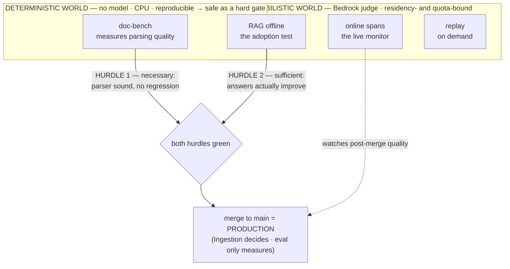
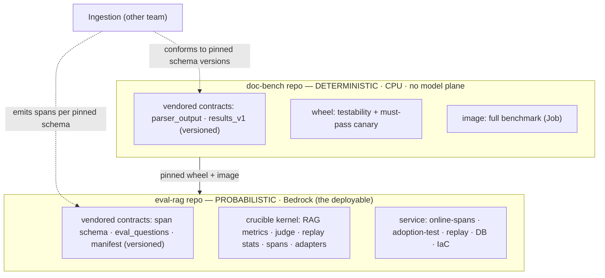
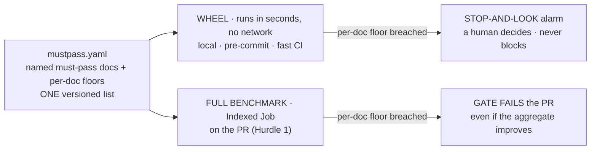
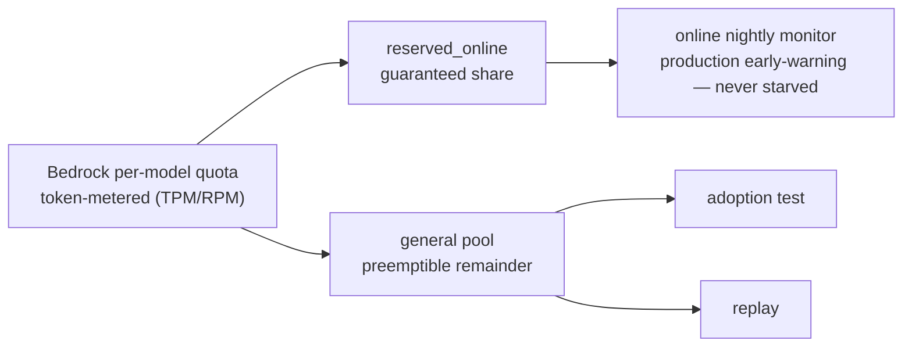
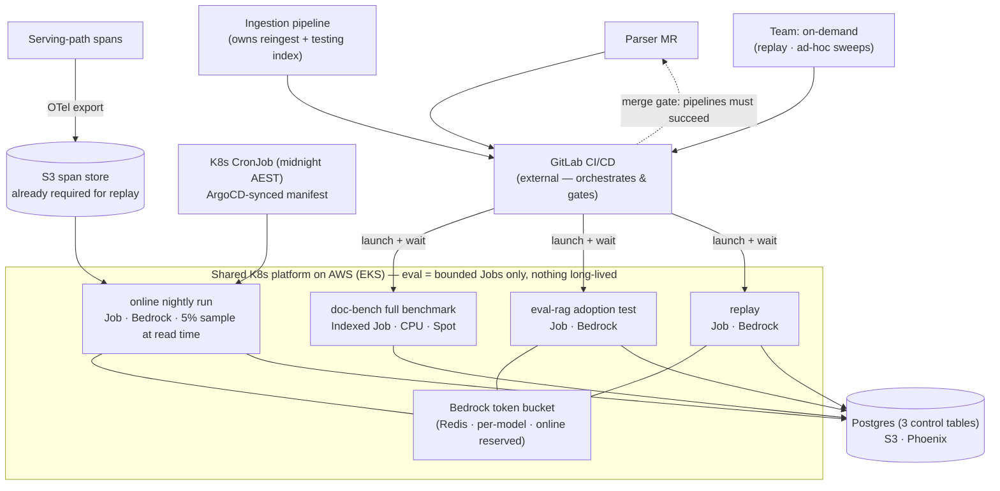
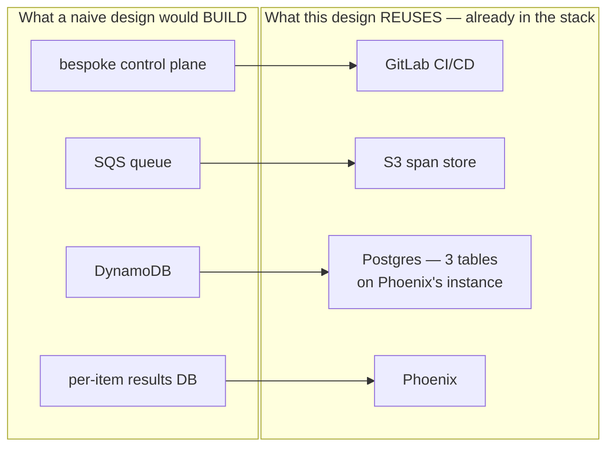
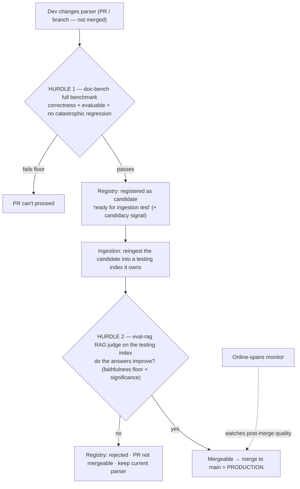

# Evaluation Service — Architecture Design

## 0. The shape, in one paragraph

The Evaluation Service is **three components across two worlds**. 

The **deterministic world** is doc-bench (document parsing): no model, CPU, reproducible, safe as a hard gate. 

The **probabilistic world** is everything judge-based — RAG offline (the adoption test), online spans (the live monitor), and replay, all on Bedrock, all residency- and quota-bound. 

Adoption of a parser requires **two hurdles**: doc-bench is *necessary* (the parser code is sound and doesn't regress parsing), and the RAG test is *sufficient* (the answers actually improve). 
The service **provides both measurements and never makes the adoption decision** — Ingestion owns the testing index and the RAG gate, and because **main is production**, a change merges (goes live) only once both hurdles pass. *(Both cross-team facts — Ingestion's gate/index ownership and the main-is-production release model — are the working model and are being confirmed with Ingestion; §4 states the fallback if either differs.)* Every topology choice below falls out of those facts.

---

## 1. The organising boundary: deterministic vs probabilistic

This is the single idea that makes the design legible. Sort every concern by which world it lives in:

| | **Deterministic world (doc-bench)** | **Probabilistic world (eval-rag: RAG-offline · online-spans · replay)** |
|---|---|---|
| What it measures | parsing quality | answer quality (faithfulness, relevancy, ctx precision/recall) |
| Model plane | **none** | **Bedrock** (au. inference profiles) |
| Compute | CPU only | CPU (judge is remote on Bedrock) |
| Reproducible? | yes → safe as a hard gate | relatively yes → **absolute** judge scores are monitoring signals, never gates; the judge gates **only on paired baseline-vs-candidate deltas with significance** (Hurdle 2), where its noise hits both arms and cancels |
| Needs token bucket / verdict cache / κ-calibration / residency? | **no** | **yes — all of it** |
| Cost driver | parser-run wall-time (OCR) | Bedrock TPM/RPM ($ per call) |

Why this matters: **every hard, expensive, risky thing — token bucket, residency, judge calibration, prompt-injection defence, PII erasure, the cost circuit breaker — lives entirely in the probabilistic world. doc-bench has none of it.** Keeping that boundary clear is what lets doc-bench be a cheap deterministic gate and supports RnD.

**On judge reliability (evidence position, mid-2026):** "probabilistic" does not mean "unreliable." Current evidence puts well-engineered LLM judges at ~80–90% agreement with human annotators — on par with how often humans agree with each other (~81%) — and the techniques that get there are the ones this design adopts: **pinned evaluation steps** (G-Eval with fixed steps, so the judge never re-derives its rubric between runs), **decomposed verdicts** (claim-extraction/QAG for faithfulness and DAG decision trees, turning one fuzzy 0–1 score into many near-binary checks), **reference-based metrics offline** (the gold set supplies expected outputs — empirically one of the largest reliability levers), temperature-0 judging, and the verdict cache. The same 2026 research is equally clear on the limits — agreement is an *aggregate*; reliability is not uniform across tasks; stress-tests (RAND's Judge Reliability Harness, 2026) find high error rates on adversarial and borderline slices; the best judges' κ vs humans (~0.8) still sits below human-human (~0.96) — which is precisely why the calibration job, self-consistency re-checks, and delta-gating remain. Net posture: **engineer the judge to a measured reliability target, verify it continuously, and gate only on paired deltas where residual noise cancels** — confidence upgraded, structure unchanged.

---

## 2. Repo structure (and the debate you invited)

- **`contracts` (the surface, not yet a repo, subjecto to discussion) — interim arrangement.** The schemas two parties must agree on are: `parser_output`, `results_v1`, the span schema, the manifest, `eval_questions`. Today `parser_output.schema.json` and `results_v1` live **in doc-bench**, and that stands: doc-bench is the de facto home of the parsing contracts, and the span schema / `eval_questions` formats live in eval-rag. What is preserved from the original argument is the part that actually matters: each schema is **versioned, and consumable as a published artifact** (the doc-bench wheel, or the schema JSON copied with its version) — Ingestion conforms to the *schema file at a pinned version*, never to the repo's internals, so the wrong-direction coupling is contained rather than structural. The residual risk is honest: a schema change is now a doc-bench/eval-rag release rather than a neutral-package release, and nothing *mechanically* stops the host repo evolving a schema unilaterally. **Revisit triggers (any one fires the hoist):** the first breaking change to a shared schema; Ingestion needing to programmatically validate against the schemas in their CI; or formalising the Hurdle-2 handoff payload (`adoption_test_request`) — at that point the hoist is a mechanical move of files that already have versions, not a redesign.

- **`doc-bench` (separate) — the examiner** It's a different *kind* of thing: deterministic, CPU, no model plane, its own cadence, shipped as a **wheel** (testability + must-pass canary — see §2a) **+ image** (full-benchmark Job). Folding it into eval-rag would couple a model-free deterministic kernel to a Bedrock service for no benefit. Keep it out.

- **`eval-rag` (the deployable) — one repo for RAG-offline + online-spans + replay. This is the debatable one; here's my argument for one, not two.**
  - *For one repo:* all three surfaces are the **same crucible kernel** (RAG metrics, judge orchestration, replay statistics, span handling, adapters) plus the **same Bedrock plumbing** (token bucket, verdict cache, residency, calibration). Splitting online-spans into its own repo duplicates the hardest-won, most safety-critical code. They differ only in *trigger and cadence* (nightly schedule vs Ingestion-triggered vs on-demand) — different **entrypoints into one image**, all bounded scale-from-zero Jobs, not different repos.

So, two repos for now: `doc-bench` (hosting the parsing contracts) and `eval-rag` (hosting the span/eval-questions contracts); Ingestion pins published schema versions; `eval-rag` pins the `doc-bench` wheel+image.

### 2a. The doc-bench wheel — small, but the one signal we never compromise

The wheel surface of doc-bench is deliberately tiny, and that is exactly why it's valuable. It earns its place twice over:

1. **Testability (super lightweight).** In seconds, with no network and no cluster, it confirms a parser produces **well-formed, contract-conformant output** the eval pipeline can actually read and score. This is the cheapest signal in the whole system — runnable locally, pre-commit, or in any fast CI step — and it answers "is this parser even evaluable?" *before* anyone spends a full-benchmark run or an Ingestion reingest on it.

2. **A curated set of must-pass representative documents.** The wheel carries a small, deliberately-chosen set of representative PDFs/docs — the shapes the product cannot afford to parse worse (the critical, the common, and the historically-fragile: tables, multi-column, scanned, rotated, the specific domain forms we live on). **These are non-negotiable. There is no acceptable trade in which a candidate parser significantly regresses on them** — a candidacy signal, a mean improvement elsewhere, none of it buys back a break here. A significant regression on a wheel doc is a **smoke alarm: stop and look**, not a routine metric dip to be weighed against other gains.

**Why this matters even though the full benchmark is the formal gate.** The full benchmark's *aggregate* statistics can mask a regression on a single critical document — a candidate that lifts the mean while breaking exactly the doc you can least afford to break. The wheel pins those documents explicitly, by name, so a must-pass regression cannot hide behind a green average. It is the **per-document floor the aggregate gate structurally cannot guarantee**, and because it's so cheap it runs *everywhere the full benchmark is too heavy to* — giving an instant, ever-present canary on the documents that matter most.

**Where the floor is enforced (so "must-pass" and "never blocks" don't collide).** The wheel *alarms*; the *gate* enforces. Hurdle 1's pass rule includes **per-document checks on the named wheel documents** — a significant regression on any of them fails the gate even if the aggregate improves — which is how the floor blocks on the PR without the wheel itself ever being a gatekeeper. Outside the PR (local, pre-commit, fast CI), the wheel runs the same named-document floor in seconds and raises the stop-and-look alarm; the human decides.

**What it is not.** The wheel is **not** the formal Hurdle-1 gate (the full benchmark is) and it is **not** a gatekeeper that runs on the PR — there the full benchmark is a superset, so the wheel would be redundant. Its job is to be the fast, omnipresent alarm in every context the full benchmark is too slow for, holding the line on the documents that must never break.

---

## 3. Runtime topology on EKS/AWS

The key realisation: **orchestration is owned by GitLab CI/CD plus the cluster's clock; execution runs on the company's shared Kubernetes platform on AWS (EKS) — and nothing in eval is long-lived: every surface is a bounded, scale-from-zero workload.** MR pipelines launch the gate Jobs; a native **K8s CronJob** (midnight AEST, ArgoCD-managed) fires the nightly run; everything else is launched **by the team, on demand**. There is no bespoke control plane, **no queue, no AWS eventing into eval, and no always-on consumer**. (§3b records the execution-model decision trail and the open orchestrator questions.)

**Trigger model (pinned):** *GitLab owns change-driven and human-driven evaluation; the cluster owns the clock — all three defined in git.* Concretely: `merge_request_event` (pipeline changes, gated pre-merge), manual/cross-project runs (replay, sweeps, backfills), and the **K8s CronJob** for the nightly check (ArgoCD-synced manifest, so cadence changes are PRs). **EventBridge and the API-destination trigger were removed**: with RAG evaluation gated on PRs and bulk checks team-initiated, no machine-initiated event path from ingestion remained — so the ingestion↔eval contract shrinks to **data at rest only**: the S3 artifact/manifest layout and the span schema. No event schema to agree, version, or drift.

| Surface | Trigger | K8s primitive | Compute | Model plane |
|---|---|---|---|---|
| **Online nightly monitor** | **K8s CronJob** (midnight AEST; `concurrencyPolicy: Forbid`; ArgoCD-synced) over the previous day's window of the S3 span store | **Job** (from CronJob), Karpenter + Spot | CPU | Bedrock |
| **Ad-hoc sweeps** (e.g. bulk-onboarding parse health) | team-initiated: manual run, or a cross-project trigger from Ingestion's own onboarding pipeline | **Job**, Karpenter + Spot | CPU | — |
| **doc-bench full benchmark** (Hurdle 1) | parser MR pipeline | **Indexed Job**, Karpenter + Spot | CPU | — |
| **eval-rag adoption test** (Hurdle 2) | Ingestion pipeline (post-reingest) | **Job**, Karpenter + Spot | CPU | Bedrock |
| **replay** (retrieval-invariant) | on demand | **Job**, Karpenter + Spot | CPU | Bedrock |

> **[Karpenter — blocked in env 3, per Kamal]** Kamal has informed us that **Karpenter still has a permission issue and is not available in environment 3.** The "Karpenter + Spot" column above is therefore the *intended* steady state, not the day-one reality in 3. Until the permissions are resolved, eval's Jobs schedule onto the cluster's existing (pre-provisioned / managed) node capacity — no behavioural change to any surface, only how nodes are sourced; every workload is still a bounded, scale-from-zero Job. **Action:** track the Karpenter permission fix as a dependency for env 3; revisit autoscaling/Spot economics once it lands. Nothing in the topology, triggers, or data tier depends on Karpenter specifically — it is a node-provisioning detail.

## 3b. Execution model — the shared Kubernetes platform on AWS **[DECIDED — org alignment; decision trail recorded]**

> **Decision:** evaluation executes as bounded Kubernetes workloads (Jobs, one Indexed Job, one CronJob) on the **company's shared EKS platform** — the same platform Ingestion and the orchestrator run on. Eval is a small tenant of it: bursty, scale-from-zero, nothing always-on.

**Decision trail (kept honest):** an interim revision ran everything inside CI runners, on the correct observation that eval's intrinsic load is tiny — ~100 RAG queries and ~200–1,000 documents per run, I/O-bound on the Bedrock token bucket. **That analysis stands as the statement of eval's own requirements**: it sizes the resource requests and forbids eval from over-claiming platform capacity. It was superseded by organisational context that fired return-gate (c) early: **everything runs on K8s, eval will substantially reuse Ingestion and orchestrator components, and the platform's scaling is built precisely for bursty-then-nothing loads.** When the platform owns the machinery, "machinery without a workload" stops being an objection — eval consumes a shared capability instead of building a private one.

**What returns with this decision:** a Job per surface; **Indexed Job** sharding for doc-bench (the in-runner model's CI-timeout veto is moot); the nightly **CronJob** (kubelet fires it directly; `suspend: true` for incidents); per-surface **IRSA** least-privilege (cleaner than the runner-class workaround); and the thin `launch-job` helper + eval-namespace RBAC for pipeline-launched Jobs — *unless the orchestrator provides launch/wait natively (open question 1)*.

**What held through every execution-model revision** — evidence the load-bearing parts were placed at the right layer: the trigger model and the merge-blocking semantic; the data tier (claims on Phoenix's Postgres, scores in Phoenix, evidence in S3); the **spend lock** (Spot interruption is identical from inside a Job or a runner); the token bucket; the data-at-rest contract with Ingestion.

One-liner: *"Evaluation is a small, bursty tenant of the shared platform: a container image, a handful of bounded Jobs, three tables, and a token bucket — nothing it runs is long-lived, and nothing it owns is infrastructure."*

A useful side-effect of the nightly cadence: the online run executes off-peak, so it never competes with daytime gate runs for Bedrock quota — the token bucket's online-reserved share remains as a guarantee, but in practice it's rarely contended.

> **[SQS — subbject to discussion]** Earlier drafts fed the online monitor through an SQS queue consumed by a long-lived KEDA Deployment. Removed because the **S3 span store — already a hard requirement for replay — is the durable buffer**: scheduled micro-batches over a trace store are the conventional pattern for online LLM eval, a queue would be a *second delivery channel* for data already landing durably, and sampling deterministically **at read time** from the store is *more* robust under load than sampling at the edge (nothing can ever be dropped). Reintroduce SQS + a KEDA-scaled consumer only if **(a)** a pinned freshness SLO demands drift detection faster than the batch interval, or **(b)** ingestion starts emitting completion events at high frequency. Until one of those is true, the queue is by-default architecture — exactly what this design prunes.

**Shared state:** Postgres — three control tables riding on Phoenix's required instance (`claims` spend lock, slim `eval_runs` provenance, `comparison_reports` verdicts); S3 (evidence/raw/snapshots/spans + Parquet score archive); Phoenix (runs, experiments, per-item scores). Full rationale and alternatives survey in §3a. The **parser-candidate registry remains the MR itself.**

**Cross-cutting (probabilistic world only):**
- **Bedrock token bucket** — ElastiCache/Redis Lua, **per-model**, **shared by online + adoption-test + replay**, token-metered (not request-metered). Critically, the **online monitor holds a reserved share**; adoption-test and replay are preemptible against the remainder so a big experiment can't starve the production early-warning system.

- **repro-key idempotency** (Postgres `claims` conditional insert + lease — authoritative before any Bedrock spend; §3a), **VPC interface/gateway endpoints** (the in-VPC claim is false without them), **residency** (au. profiles for anything that ships spans/legal context to a model), **dead-man's switch** (scheduled-run-missed, zero-spans-in-window, and **span-store staleness** alarms — silence must page, not read as green).

---

## 3a. Data tier — final shape, and the one table we must defend **[PROPOSED — subject to review]**

> **Status: open for challenge.** This is the **first workload this team has operated where redoing work costs money per item** — every judge check is paid Bedrock calls, so a retry is a billing event, not just wasted CPU. We have not run this pattern before, and we explicitly invite scrutiny of it — especially because this service is an early piece of the **AI platform this team will operate as more GenAI applications arrive**: whatever is settled here will likely be inherited.

**The tier, after consolidation** (control plane → GitLab; queue → span store; DynamoDB → Postgres; per-item results → Phoenix):

| Store | Holds | Why it's the right home |
|---|---|---|
| **S3** | artifacts, spans, raw verdicts, Parquet score archive | immutable evidence; already mandatory for replay |
| **Phoenix** (already in the stack) | runs/experiments + per-item scores (annotations) | one copy of scores, browsable next to the traces that produced them; rebuildable from the S3 archive, so still not a single point of failure |
| **Postgres** — 3 tables, riding on the instance Phoenix already requires | `claims` (spend lock), slim `eval_runs` (pipeline↔experiment provenance, coverage, cost), `comparison_reports` (gate verdicts) | the control residue no observability tool models |

Scale honesty: ~3M rows/year, ~99% of them in `claims`, ~0.5 GB — no partitioning machinery; the only hygiene is pruning claims of retired `eval_spec_version`s.

**Why `claims` must exist — four conditions, all of which hold here:** (1) redone work costs real dollars; (2) thousands of items share one run on Spot compute, so partial progress matters; (3) verdicts are cached *across* runs — the baseline is computed once, ever, and every MR reuses it; (4) no broker provides a lease — **when SQS was removed (§3 note), its visibility timeout — which *is* a claim-and-lease mechanism — went with it, and the function moved here.** Workloads missing any one of these conditions don't need this table, which is why most batch systems don't have one.

**In plain terms:** think of `claims` as a **sign-out sheet for paid work**. Every quality check costs real money, and the work runs on cheap "interruptible" machines that can be taken away mid-run — so before any check is paid for, a worker signs its name against it, and once it's done the answer is kept on file. That gives us three things: two workers never pay for the same check at the same time; if a machine is yanked away halfway through a thousand checks, the next one picks up exactly where it left off instead of paying for all thousand again; and the slow-to-compute "before" baseline that every change is measured against is paid for **once, ever**, then reused by every future change. We built this small piece ourselves only because nothing we already use offers a "sign out this paid item and don't lose it" guarantee — most systems never need it because their work is free to repeat.

**Concrete example.** A parser MR fires `rag-gate`, which launches the `adoption` Job over a gold set of ~100 questions × 4 metrics (faithfulness, answer_relevancy, ctx_precision, ctx_recall) — ~400 paid judge evaluations per arm, each a temperature-0 Bedrock call. For every `(item, metric)` the worker computes a `repro_key` (a hash of the question+context+answer, the dated judge `model_id`, the pinned `prompt_version`, and `eval_spec_version`) and does a conditional `INSERT … ON CONFLICT` into `claims`: a fresh row is `leased` to the pod with a 10-minute `lease_expires_at`; a row that's already `done` returns its cached `score` with **zero Bedrock spend**. The **baseline arm** (the current production parser) is almost entirely `done` cache hits — it was computed once on the first MR ever and every subsequent MR reuses it — so this run only pays for the **candidate arm**. Now suppose Spot reclaims the node at item 270: SIGTERM lets in-flight evaluations finish, the 269 already-`finalize`d rows stay `done`, and the ~3 rows still `leased` simply let their lease expire. GitLab's `backoffLimit` retry starts a new pod, which **steals** the expired leases and resumes — re-billing only those few items, not all 270. When all items resolve, the worker writes the paired `wilcoxon_p`, `cliffs_delta`, and `mde` into `comparison_reports`, and the Job's exit code becomes the gate verdict on the MR. Without `claims`, that same Spot reclaim would have re-bought 270 paid calls, and every MR would re-buy the entire baseline arm from scratch.

**Alternatives examined — this list is the defense; challenge any line:**

| Alternative | Why it doesn't take the job |
|---|---|
| **Phoenix** | has runs/experiments/scores (we use it for exactly those) but **no claim, lease, or conditional-write primitive in its API** — coordination isn't observability |
| **SQS visibility timeout** | was the lease; removed with the queue. Reintroducing a queue *to obtain a lease* re-adds the larger component |
| **Argo Workflows memoization** | right idea, wrong granularity (per-step, not per-item×metric); maintainers state the ConfigMap backing "will not scale to a large number of entries" |
| **Flyte / Temporal / Dagster** | real input-hash caches — implemented as tables in **their own Postgres**; adopting one swaps settled GitLab orchestration for a platform wrapper around the same table |
| **Redis** (already ours) | `SETNX`+TTL covers the *lease* half; the *cache* half must survive months, and eviction silently re-bills |
| **K8s Lease objects** | leader election for dozens of controllers in etcd — not millions of work items |
| **S3 conditional writes + Athena** | create-if-absent yes; leases, atomic steal, transactional finalize no — a hand-rolled lock manager protecting money; Athena is read-only analytics |
| **DynamoDB** | would genuinely work; not chosen because Postgres free-rides on Phoenix's mandatory instance. **Written fallback:** if that instance ever stops existing, `claims` → DynamoDB (conditional writes + native TTL), the other two tables → S3 |

**Platform trajectory [for discussion]:** today this is deliberately *one table inside eval*, not a service. If a second GenAI application hits the same four conditions, the candidate move is promoting `claims` into a **shared platform primitive** — an idempotency-and-budget ledger — rather than each app growing its own. We are *not* building that now (same YAGNI discipline as everywhere else in this design), but we name the trajectory so the platform review can plan for it instead of discovering it.

---

## 4. The adoption flow — two hurdles, both pre-merge; main is production

main **is** production: if a parser change is merged, it is live. So **both hurdles are pre-merge gates**, and the change stays an unmerged PR/branch — tracked by the registry — until it has earned its way in.

The load-bearing reframes from the adversarial debate, now built in:
- **Hurdle 1 registers a candidate; it does not merge it.** doc-bench passing means "this parser is sound and ready for the ingestion RAG test," recorded in the registry as the eval→Ingestion handoff. It is a **correctness + evaluability + regression-floor** gate, *not* a "parsing must improve" gate — a strict improvement gate both blocks RAG-helpful changes (boilerplate strippers that lower text metrics) and waves through parsing-better/RAG-worse ones. Parsing-improvement is a *candidacy signal*, never a merge verdict.
- **Hurdle 2 is what makes it mergeable, and merging is adoption.** Ingestion reingests the candidate into a testing index it owns and runs the RAG judge there; eval supplies the RAG measurement. Only when the RAG judge passes is the PR mergeable — and because main is production, the merge *is* the adoption. Ingestion owns the testing index and the RAG gate; eval measures; the merge is the mechanical consequence of both required checks going green. There is **no separate "config flip" and no "merged-but-not-live" state**. *(Ownership of the testing index and the RAG gate is our proposal, being confirmed with Ingestion. Main-is-production is the pipeline repo's release model, also flagged for confirmation — if they deploy on a separate schedule, a "merged → deployed" step appears after the merge and nothing else in this flow changes.)*
- **Until the significance bar and metric policy are agreed (§6), both gates run in *no-regression* mode:** a candidate must not be measurably worse on any headline metric (with the faithfulness floor always hard). The gates are operational from day one; the open policy decision only tunes how *strict* they are, not whether they exist.
- **The registry is the connective tissue** between two hurdles and two owners: `registered / awaiting-RAG → RAG-passed / mergeable → merged`, or rejected at either gate. Under GitLab CI/CD this **is the MR's own state** — required checks + labels + the merge itself — so there's no bespoke registry service on day one; add a small read-model later only if you need cross-MR dashboards.
- **The two hurdles run on different corpora** (benchmark gold vs production-representative), so the parser runs twice and Hurdle 1 is a doubly-weak predictor (different metric *and* different distribution) — the standing argument for a domain gold set.

---

## 5. Non-negotiable invariants (what I'd refuse to ship without)

1. **A parsing pass must be structurally incapable of reading as an adoption signal** — separate stores, separate dashboards, separate gates; the only thing that makes a change mergeable (and main is production) is a passing Hurdle-2 RAG test on the testing index. The entire failure mode is "parsing improved, so we shipped it."
2. **doc-bench never touches Bedrock, residency, the token bucket, or calibration.** 
3. **The online monitor gets a reserved Bedrock quota share.** A discretionary experiment (adoption test / replay) must never be able to starve the production early-warning system.
4. **The contract surface is versioned and consumable independently of any repo's internals.** Ingestion conforms to pinned schema versions (published artifacts), never to doc-bench/eval-rag source; consumers reject unknown major versions loudly. The neutral `contracts` repo is the end state, parked until a revisit trigger fires (§2) — but version discipline on the schemas is in force from day one, repo or no repo.
5. **Eval measures; Ingestion owns the testing index and the RAG gate.** The service builds no production index and owns no reingest; adoption is the **merge to main (= production)**, gated by both hurdles. Eval never merges and never decides.

---

## 6. Open decisions I'd force before building (adversarial)

- **Replay Case A/B ownership.** Does eval own retrieval-invariant span replay (prompt/generator/judge — Case A; query-params — Case B)? Index-affecting replay (Case C) is Ingestion's reingest. If eval owns neither, **eval builds no OpenSearch index at all** and its vector-store role collapses to read-only querier — a materially simpler design. Decide this first; it's the biggest remaining fork.
- **doc-bench results → Phoenix mapping.** Do deterministic parsing scores land in Phoenix as experiments alongside the judge scores (one pane of glass, but Phoenix's experiment model is trace-shaped), or only in Postgres/S3 (cleaner boundary, two places to look)? The Part 1/Part 2 fork — resolve before the data-model consolidation pass.
- **Does the candidate registry need to be more than the MR?** By default the MR *is* the registry (checks + labels + merge), which spans both teams for free. Only build a separate read-model if you need cross-MR queries ("everything queued for the ingestion test," "candidates older than N days") — and even then it's a table fed by GitLab webhooks + RDS, not an orchestration service.
- **Domain gold set for Hurdle 1.** Public benchmarks → production parsing → production RAG is two lossy hops; a domain gold set closes the first.
- **Online cadence — PINNED: nightly (product decision).** Drift detection runs up to ~24h behind live; accepted because the pre-merge gates are the primary protection and the monitor is the backstop. The cadence is **a cron line, not architecture** — escalate to intraday micro-batches if an incident ever shows nightly is too slow, with zero design change; a queue returns only at sub-batch-interval SLOs (§3 note).
- **Orchestrator integration (§3b)** — the four questions for the platform team: which engine (decides whether the claims-table migration gate fires), what "reusing Ingestion" means mechanically (could settle replay A/B), schedule/report-back ownership, and whether the Hurdle-2 handoff moves to workflow composition. These refine the design; none block the build.
- **GPU for parser runs — PARKED: CPU-only (volume doesn't justify it).** Every surface, including the doc-bench full benchmark, runs on CPU (Karpenter + Spot); no GPU node group, no CUDA image, nothing provisioned on spec. **Un-park trigger:** an OCR-heavy candidate parser whose full-benchmark wall time on the CPU Indexed Job — *after* sharding (`completions`/parallelism) — exceeds the acceptable MR feedback window, or a corpus growth that does the same. Even then it's a node decision, not an architecture change: the same Indexed Job gets a `nodeSelector`/toleration onto a tainted Spot GPU node group and a CUDA build target; nothing upstream or downstream moves.
- **Control-plane API — PARKED: eval has no callers an API would serve.** Ingestion needs an API because its callers are end users through a UI (untrusted, high-cadence, request/response — hence JWT, scopes, polling). Eval's callers are team members (→ GitLab manual pipelines, with auth/RBAC/audit free), Ingestion's pipeline (→ multi-project trigger + `strategy: depend`; the verdict *is* the pipeline status), and the clock (→ CronJob); results are read in Phoenix and Postgres/Athena. An API would re-implement GitLab's auth and job model for callers already inside GitLab — and would reintroduce the always-on Deployment this topology promises doesn't exist. **Return triggers:** (a) a non-GitLab machine consumer needing verdicts synchronously *and* unable to use a read-only view/Athena; (b) eval-as-a-service for a second GenAI product (arrives together with promoting `claims` to a platform primitive); (c) the registry read-model growing past webhooks→table→dashboard.
- **The claims table (§3a)** — flagged for review: first time this team holds paid-work coordination state. The alternatives survey is written precisely so reviewers can attack it line by line; the open platform question is whether this graduates to a shared idempotency/budget primitive when a second GenAI app needs it.

---

## 7. Honest build state (so the plan isn't fiction)

- **doc-bench integration, the adoption-test surface, online-spans, and replay are net-new, plus version-pinning the contract surface.** crucible today has the RAG-judge kernel (Bedrock judge works) and the replay *statistics*, but no service surfaces, no deterministic lane, and no spans pipeline; the shared schemas stay vendored (parsing contracts in doc-bench, span/eval_questions in eval-rag — the parked hoist, §2) but must gain explicit versions and published-artifact form. **Orchestration is *not* net-new — it's GitLab CI/CD** (the gates, the cross-team handoff, the merge gating), so there's nothing bespoke to build or defend there; the candidate registry is the MR's own state.
- Sequence the build so the **measurement-provider boundary and the contract-surface version pinning land first** (everything else depends on them; the repo hoist itself stays parked per §2), then Hurdle 1 (doc-bench gate as a GitLab pipeline launching the Indexed Job), then the online monitor, then Hurdle 2 (the cross-team adoption-test pipeline), then replay — and resolve the §6 Case A/B fork before committing to any index-building machinery.

---

## 8. Known weakest points & shoring plan (pre-review red team)

*Stated here deliberately, before a reviewer states them for us. Each entry: the attack at full strength, why the current flags are honesty rather than mitigation, and the shoring action with a deadline relative to the design review.*

### 8.1 The spine runs through another team's unbuilt, unagreed work — **the structural weakness**

**The attack:** Hurdle 1 is, by this design's own admission, a weak predictor of answer quality. Hurdle 2 — the only gate that can ship anything — requires from Ingestion: a per-candidate reingest pipeline, testing-index construction and teardown, acceptance of gate ownership, and (for the nightly monitor and replay) serving-path span emission to a schema they have not signed. All are marked *[being confirmed]*. Until they confirm, the only operational protection is the gate that doesn't predict the thing we care about.

**Shoring (before review):** get the two smallest asks **signed, not flagged** — the span schema field profile and the `adoption_test_request` v1 handoff (Detailed Design §3.3). Both are one-page agreements.
**Shoring (written Plan B, because one must exist):** if Ingestion declines the index-building role, the recorded fallback is: *(a)* the gate degrades to Hurdle 1 + Case-A replay (prompt/generation changes remain fully testable; parser adoption requires an explicit, named risk acceptance per merge), and *(b)* the pruned index-building machinery is re-opened as an eval-owned capability — a known, costed re-expansion, not a redesign. Naming Plan B removes the "load-bearing wall is a proposal" attack: the wall has a documented temporary support.

### 8.2 The gate may be statistically toothless at launch — **the technical weakness**

**The attack:** "no-regression mode" passes anything *not measurably worse*; with ~100 gold questions and a noisy judge, the minimum detectable effect is plausibly ~5 points — so low power works in the candidate's favour, and the gate is a rubber stamp with a p-value.

**Shoring (done — Detailed Design §4.3b):** sensitivity is now an engineered, *published* property: one-sided paired tests; σ_d measured from already-cached baseline scores and self-consistency runs; the achieved **MDE stored in `comparison_reports` and printed on every MR verdict**; and a sizing rule that turns "we need 2-point sensitivity" into a gold-set n and a dollar figure. The gold set's size becomes a budget decision with a formula behind it, not a default.

### 8.3 The money ledger rides on an observability tool's database

**The attack:** `claims` protects real spend, and it lives on "the instance Phoenix already requires" — chosen by colocation convenience. If that instance is a container-local Postgres with casual ops, the spend lock has weaker durability than the spend it guards.

**Shoring:** rung 1 of the data-tier ladder now carries a **precondition**: the Phoenix instance must be a managed, backed-up Postgres (RDS-class: automated backups, PITR, an owner who is paged). Verify those four facts with the platform team; if any fails, **rung 3 (claims → DynamoDB) becomes the default**, not the fallback. One paragraph of homework closes this entirely.

### 8.4 Runners-up (real, smaller, named)

- **Hurdle-2 latency & bypass pressure.** A per-MR reingest means merge feedback in hours and parser MRs queueing for testing indexes — which is social pressure to bypass the gate. Mitigations: gate only parser-touching MRs (already true via `rules:changes`), batch candidate testing windows if MR volume grows, and treat a bypass request as the incident it is. Watch the metric: time-from-MR-to-verdict.
- **Human-label supply for κ calibration.** The calibration loop assumes a continuing stream of human-labelled examples nobody has budgeted. Shoring: make it a standing budget line (N labels/quarter, named owner) before the first κ number is promised on a dashboard.