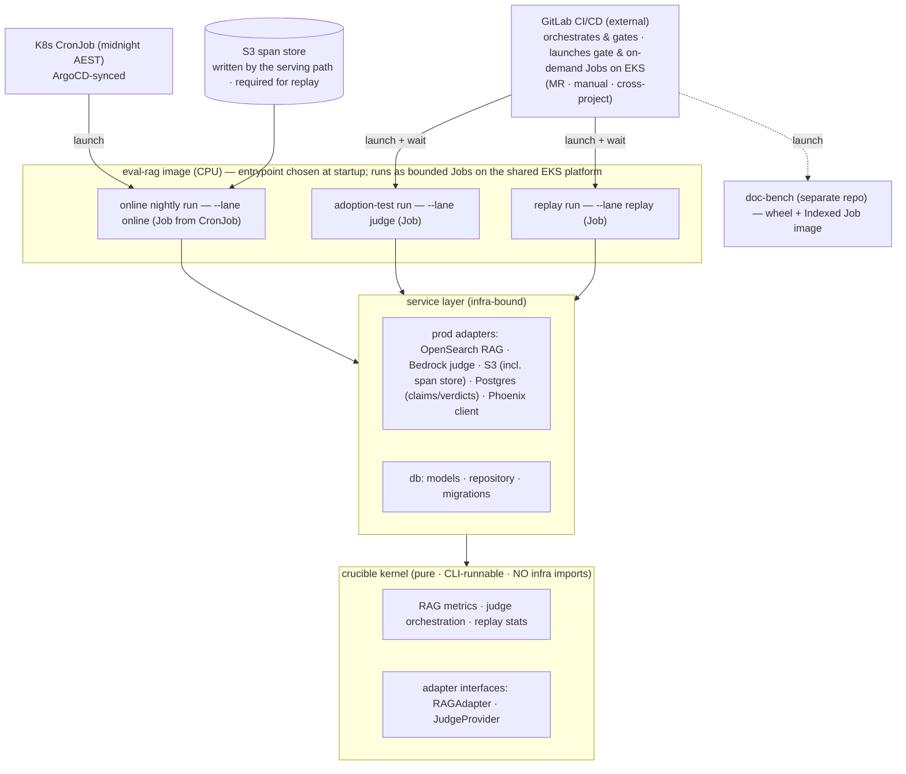

# Evaluation Service — Service Design (Part 1: structure, seams, interfaces, orchestration, surfaces)

*The layer below the topology doc. Concrete internals of the `eval-rag` deployable and how doc-bench and the four surfaces plug in. Part 2 (data model, reproducibility-key write path, Bedrock model plane, cross-cutting) reconciles the existing runtime-spec rather than re-deriving it.*

---

## 1. Internal structure of the deployable

`eval-rag` is **one codebase, one image, several entrypoints**. The running role is a startup argument; the shared kernel + DB + domain code stay DRY.



**The one-way seam is the load-bearing rule:** the service layer imports the kernel; **the kernel imports neither the service layer nor any infra SDK** (`boto3`, `opensearch-py`, `sqlalchemy`). Enforced with an **import-linter** contract in CI. This is what keeps crucible runnable as a plain CLI for local dev while the same functions run inside the service — and what stops infra concerns leaking into the eval logic.

doc-bench is **not** a module in this image. It's a separate repo consumed two ways: the **wheel** (the deterministic lane + the wheel canary, §2a of the topology doc) and the **image** (the full-benchmark Indexed Job the **GitLab pipeline** launches). It never imports eval-rag and never touches Bedrock.

---

## 2. The kernel ↔ service seam (Phase-0 prerequisite, and mostly net-new)

The service depends on the kernel through **functions, not the CLI**, and on the world through **two adapter interfaces** the kernel defines and the service implements.

### `RAGAdapter` — retrieval and generation, split
```python
class RAGAdapter(Protocol):
    def retrieve(self, query: str, index_ref: IndexRef) -> list[Context]: ...
    def generate(self, query: str, contexts: list[Context]) -> Answer: ...
```
- **Why split:** crucible's current adapter *fuses* retrieve+generate and is `corpus_dir`-based with a hardcoded contracts path — wrong shape for prod. The prod impl queries **OpenSearch k-NN** (same engine/dimension/space-type the index was built with — FAISS+HNSW if Bedrock KB fronts it) and calls the **Bedrock generator** (au. Sonnet profile). The split is mandatory because replay Case A re-runs *generation only* against the **recorded** context — fusing them would silently re-retrieve and confound the test.
- Interface in the kernel; prod implementation in the service layer (it needs prod endpoints + IRSA).

### `JudgeProvider` — LLM judging on Bedrock
```python
class JudgeProvider(Protocol):
    def judge(self, metric: Metric, sample: Sample) -> Verdict: ...   # raw verdict + score
```
- Prod impl: DeepEval (`==4.0.5`, pinned) wired to an **au. inference profile** (judge model ≠ generator family), **temperature 0**, region passed explicitly. The judge default is already Bedrock in the kernel; **a second judge path in `experiments/` still hardcodes OpenAI and must be removed** before prod (and a CI test asserts no OpenAI egress).
- Interface in the kernel; impl in the service.

**Honest net-new vs exists:** the kernel *has* the RAG-judge metrics (Bedrock judge works) and the replay statistics (with the paired-Cliff's-Delta bug to fix — it's currently an unpaired all-pairs loop). **Net-new:** the prod `RAGAdapter`, the deterministic retrieval metrics (nDCG/MRR don't exist yet), the spans pipeline, the workers, and a real (non-placeholder) replay runner. **Not built at all:** the orchestration — that's GitLab CI/CD (§3) — and the registry, which is the MR's own state (§4). The seam refactor (library API + the two interfaces + import-linter) is Phase 0 and blocks everything else.

---

## 3. Orchestration — GitLab CI/CD (no bespoke control plane)

There is **no control-plane service**. Orchestration, gating, and the cross-team handoff are owned by **GitLab CI/CD** — the tool already in use — and detailed in the companion orchestration doc. The mapping:

| Responsibility | Owned by |
|---|---|
| trigger on a parser change | GitLab **MR pipeline** (`merge_request_event`) |
| run the heavy gate work | a CI job that **launches a Kubernetes Job on the shared EKS platform** and waits (or hands to the orchestrator — open question, topology §3b) |
| gate the merge | GitLab **"pipelines must succeed"** = merge is production |
| Hurdle-2 handoff to Ingestion | **multi-project pipeline** + `strategy: depend` |
| online monitor cadence | **K8s CronJob** (midnight AEST), ArgoCD-synced — the clock is the cluster's, not CI's |
| which gates run per MR | **`rules:changes:` path routing** — prompt-only change → rag-gate; parser change → parsing-gate then rag-gate |
| bulk-onboarding / ad-hoc checks | **team-initiated**: manual run, or a cross-project trigger from Ingestion's own pipeline — **no AWS eventing into eval** |
| report status | native MR pipeline status (no Checks-API code to write) |
| candidate state | the **MR itself** — checks + labels + merge (§4) |
| external / non-Git trigger | GitLab **pipeline trigger token API** |

The two gates are **pipeline stages, not API endpoints**: `parsing-gate` (Hurdle 1, doc-bench) and `rag-gate` (Hurdle 2, the Ingestion downstream pipeline). Both required ⇒ the MR can't merge ⇒ merging *is* the adoption.

**Execution model [DECIDED — org alignment; full trail in topology §3b]:** evaluation executes as **bounded Kubernetes Jobs on the company's shared EKS platform** — the same platform Ingestion and the orchestrator run on. Eval's intrinsic load is small (~100 RAG queries, ~200–1,000 docs per run; I/O-bound on the Bedrock token bucket), which sizes its resource requests — but the org runs everything on K8s, eval substantially reuses Ingestion and orchestrator components, and the platform's scale-from-zero handling exists precisely for bursty-then-nothing tenants like this. The only custom code is a thin `launch-job` helper (`kubectl create` + `wait`) and the workers themselves; the GitLab runner's ServiceAccount is scoped to create Jobs in the `eval` namespace only, and each surface carries its own **IRSA** role (doc-bench: no Bedrock). The nightly monitor is a **K8s CronJob** (midnight AEST; `concurrencyPolicy: Forbid`; `suspend: true` for incidents; ArgoCD-synced so cadence changes are PRs) whose Job reads the previous day's window from the **S3 span store** and applies the 5% deterministic-hash sample **at read time** — no always-on consumer, no queue. Backfills and custom windows are manual pipelines with variables, same image. *(Decision trail: an interim revision ran everything in-runner — correct on eval's intrinsic scale, superseded by the shared-platform context; see topology §3b, including the four orchestrator questions that may further simplify the launch path and, depending on the engine, retire the claims table per §3a's migration gate.)*

*[SQS, bracketed for honesty: a queue + KEDA-scaled consumer returns only if (a) a pinned freshness SLO demands drift detection faster than the batch interval, or (b) ingestion events become high-frequency. Until then the span store is the durable buffer and a queue would be a second delivery channel — see the topology doc §3 note.]*

This is the deliberately *unsurprising* choice: required pipelines, multi-project pipelines, and the Kubernetes executor are stock GitLab — nothing bespoke for a reviewer to attack.

---

## 4. The candidate registry — the MR *is* the registry

"Two hurdles, two owners, main-is-production" needs candidate state tracked. Under GitLab that state **is the merge request**, so there is no registry service on day one:

| State | Realised as |
|---|---|
| `awaiting-RAG` | MR with Hurdle 1 green, Hurdle 2 pending (+ an `awaiting-rag` label) |
| `mergeable` | both required pipelines green |
| `rejected` | Hurdle 2 failed → MR blocked (`rag-rejected` label) |
| `merged` | MR merged = live in production |

- **Why the MR suffices:** it already spans both teams, already carries the required-check state, and `merged` is the adoption fact observed directly rather than inferred. No schema, no API, no second store to keep consistent.
- **Drift guard (the cost of unmerged candidates):** a candidate can sit `awaiting-RAG` while Ingestion schedules the expensive reingest+RAG run. GitLab re-runs the MR pipeline on new commits to the source branch, and you can require the branch be up to date with main before merge — so a stale parsing result is re-validated, not trusted.
- **Add a read-model only if you need it:** cross-MR questions ("everything queued for the ingestion test," "candidates older than N days") justify a small table fed by GitLab webhooks + RDS, queried by a dashboard — still not an orchestration service.
- **Must-pass-set governance** still holds: the wheel's curated docs (topology §2a) are version-pinned alongside the gold set; changing them is a reviewed, recorded act, never a quiet edit to slip a candidate through.

---

## 5. The four surfaces as concrete components

| | **doc-bench (Hurdle 1 + wheel)** | **adoption-test (Hurdle 2)** | **online-spans** | **replay** |
|---|---|---|---|---|
| Repo | doc-bench (separate) | eval-rag | eval-rag | eval-rag |
| Execution | **Indexed Job** (Spot) full; local/CI (wheel) | Job | **Job (from CronJob)** | Job |
| Trigger | parser MR pipeline | Ingestion pipeline (cross-project) | **K8s CronJob** (midnight AEST) over the span store | on-demand pipeline / manual |
| Input | parser_version, corpus_version, cached baseline | testing-index ref, baseline-index ref, query set + qrels, pinned vars | the **previous day's window** from the S3 span store; 5% deterministic-hash **stratified sample at read time** | span set (S3/Athena), candidate, baseline |
| Computes | parse+score per doc; paired stats vs baseline | DeepEval suite (faithfulness, ctx P/R, answer-rel) on Bedrock + retrieval metrics; paired vs baseline | faithfulness + answer-rel **only** (reference-free), scored against the span's **recorded** context | re-run recorded spans through the changed step; paired Wilcoxon + paired Cliff's Δ |
| Model plane | **none** (deterministic, CPU) | Bedrock (token bucket, verdict cache) | Bedrock (**reserved** bucket share) | Bedrock (judge/gen if varied) |
| Output | results_v1 → S3 Parquet (+ Phoenix experiment — open mapping, §7); verdict → `comparison_reports`; MR parsing check + `awaiting-rag` label | scores → Phoenix + S3; verdict → `comparison_reports`; MR RAG check (mergeable/rejected) | scores → Phoenix (span annotations) + S3; **drift alerts** → team; never a ship decision | scores → Phoenix + S3; verdict → `comparison_reports` |
| Key risk | a must-pass doc regressing (wheel canary) | judge cost/quota; faithfulness floor | silence reading as green → **dead-man's switch** | re-retrieval confounding Case A; PII residency |

Two specifics that are easy to get wrong and are pinned here:
- **Online scores the recorded context, not a fresh query.** OpenSearch is eventually consistent (Serverless refresh ~60s); re-querying live would race the index and measure the wrong thing. Faithfulness/answer-relevancy are reference-free, which is *why* they're the only two computable online (no ground truth in prod).
- **Replay branches on the variable under test.** Case A (prompt/gen/judge) replays the recorded context with **no index**; Case B (query-params) re-queries an isolated copy; **Case C (parser/chunker/embedder) is Ingestion's reingest, not eval's** — and whether eval owns even A/B is the open boundary that decides if eval ever builds an index at all.

---

## 6. What Part 2 covers (so this part stays focused)

Deferred to Part 2, reconciling the existing runtime-spec rather than re-deriving:
- **Data model, made current** — three Postgres control tables (`claims`, slim `eval_runs`, `comparison_reports`) on the instance Phoenix already requires; per-item scores in **Phoenix** (experiments/annotations) with **S3 Parquet** as the immutable archive; no partitioning machinery (it left with `eval_results`); plus an *optional* candidate read-model only if cross-MR dashboards are needed (§4).
- **Reproducibility key + idempotent write path** — Postgres `claims` conditional insert + lease as the authoritative gate before any Bedrock spend; finalize ordering S3 → Phoenix → claim flip, every step idempotent. (Transactional outbox descoped: pipelines *wait* on Jobs, so completion is observed, not emitted.)
- **Bedrock model plane** — au. inference-profile config for judge≠generator, the per-model Redis token bucket with the online reservation, the verdict cache keyed by repro-key, and the κ-calibration job.
- **Cross-cutting** — failure/coverage semantics, the dead-man's switch, cost caps + circuit breaker, IRSA/residency/VPC-endpoints, PII crypto-shredding, the no-OpenAI-egress CI gate.

---

### Open items this part surfaces
1. **Does the registry need to be more than the MR?** Only if cross-MR dashboards are required (§4); otherwise the MR is the registry and there's nothing to build.
2. **Whether to build the candidate read-model now or later** — defer until a concrete dashboard need appears.
3. **Replay A/B ownership** (still the biggest fork) — settles whether the replay worker and any candidate-index adapter exist at all.
4. **The claims table (§7)** — flagged for team review; the alternatives survey in the topology doc §3a is the document to attack.

---

## 7. The claims table — the one piece of state we own **[PROPOSED — subject to review]**

`claims` is a single Postgres table (on the instance Phoenix already requires) doing four jobs with one conditional insert: **spend dedup** (two workers can't both pay to judge the same item), **Spot-safety** (a lease that expires when a worker dies, so the item is retried exactly once more), **verdict cache** (a `done` row means "already answered — here's where"), and **baseline cache** (the baseline's scores are computed once, ever; every MR pays only for the candidate).

**Why it exists here and not in most systems** — four conditions that must *all* hold, and do: redone work costs money per item (paid judge calls); thousands of items share one run on Spot compute, so partial progress matters; verdicts are reused across runs; and no broker provides a lease — when SQS was removed, its visibility timeout (which *is* a lease) went with it, and this table absorbed that function. Most batch workloads fail at least one condition (usually the first: redoing is just cheap CPU) and correctly have nothing like this.

**Honesty caveats, stated for the review:** this is the **first time this team has operated a paid-per-item workload**, so this mechanism is proposed, not settled — the full alternatives survey (Phoenix's API, Argo memoization, Flyte/Temporal, Redis, K8s Leases, S3 conditional writes, DynamoDB, the queue we removed) lives in the **topology doc §3a** with prior-art references, written so reviewers can challenge it line by line. And the trajectory matters: as this team takes on more GenAI applications, this is a candidate **shared AI-platform primitive** (an idempotency-and-budget ledger). It is deliberately one table today — promotion to anything shared happens only when a second application demonstrates the same four conditions.