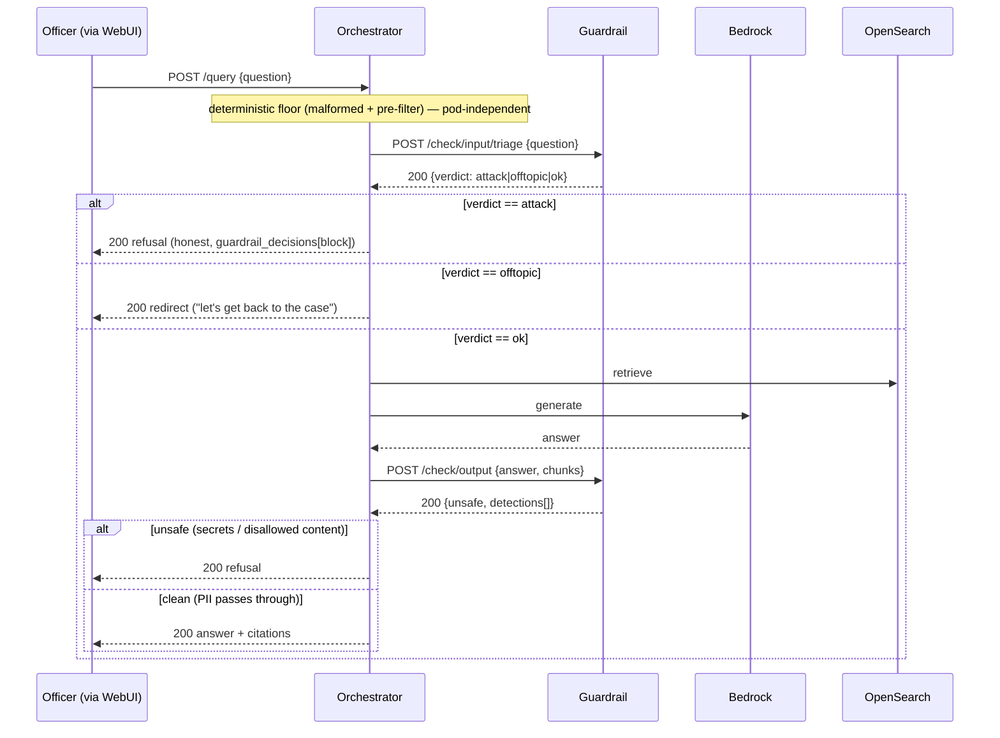
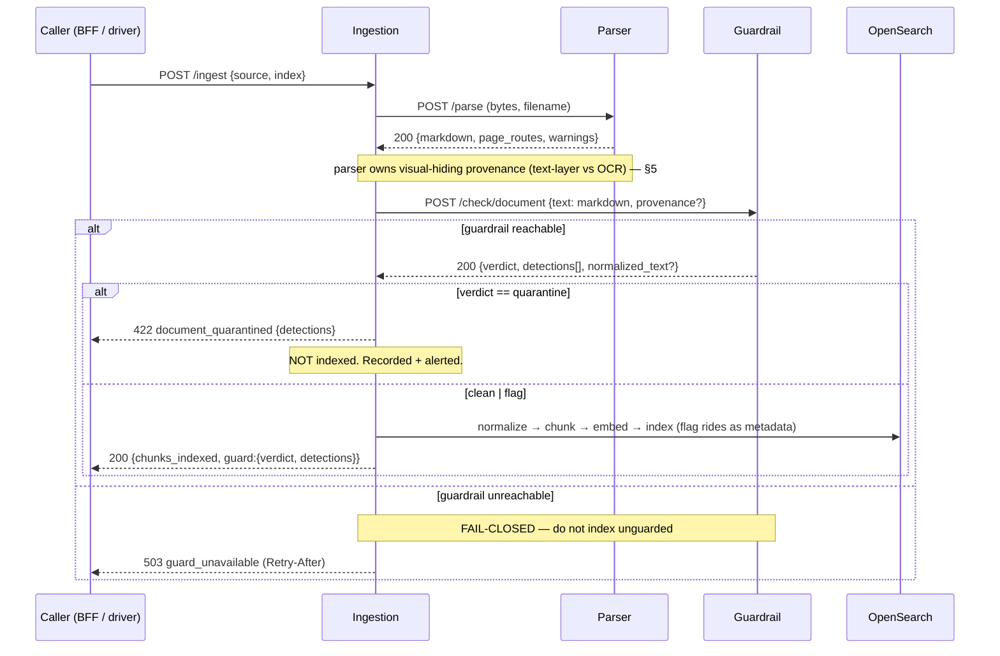

# Guardrail Service — topology

**Status:** as-built (request-time) + proposed (ingest-time) · **Scope:** how the guardrail service
sits between the other services and where each one calls it.
**Companion:** [guardrail-service-overview.md](guardrail-service-overview.md) · contracts
[guardrail-openapi.yaml](guardrail-openapi.yaml) (internal) / [guardrail-api.yaml](guardrail-api.yaml) (BFF)

The guardrail is one verdict-only pod with **two classes of caller**: the **orchestrator** at
request-time (guarding the officer's query and the generated answer) and the **ingestion** service at
ingest-time (guarding a document's parsed text before it enters the index). This doc shows both.

---

## 1. The services and their boundaries

Independent HTTP services, each with its own venv and a strict dependency firewall — **no service
imports another's Python.** Every guardrail call is HTTP-only over a location fact.

| Service | Role | Talks to the guardrail via | Wire fact |
|---|---|---|---|
| **Orchestrator** (`services/orchestrator`) | live `POST /query` pipeline: retrieve → generate → cite | `/check/input/triage`, `/check/output` | `ORCHESTRATOR_NEMO_GUARD_URL` |
| **Ingestion** (`services/ingestion`) | `POST /ingest`: fetch → parse → **guard** → chunk → embed → index | `/check/document` *(proposed)* | `INGESTION_GUARDRAIL_URL` *(proposed)* |
| **Parser** (`services/parser`) | document bytes → clean **Markdown** | — (does not call the guardrail; owns provenance, see §5) | called by ingestion via `INGESTION_PARSER_URL` |
| **Guardrail** (`services/guardrail`) | verdict-only NeMo pod (Bedrock Haiku) | — | — |

The orchestrator keeps the pod client behind a `typing.Protocol`, injected into a **pure** pipeline
stage — the `stages-pure` import contract forbids transport/NeMo imports in the stages. Ingestion wires
the guardrail exactly as it already wires the parser: a URL, HTTP-only, no import.

```
                          ┌─────────────────────────────┐
   request-time  ────────▶│                             │
   (orchestrator)         │      GUARDRAIL  (pod)        │
                          │   verdict-only · Bedrock     │
   ingest-time   ────────▶│   Haiku · fail-closed        │
   (ingestion)            │                             │
                          └─────────────────────────────┘
```

---

## 2. Request-time flow (orchestrator) — AS-BUILT

The officer asks a question; the orchestrator guards it on the way in and guards the answer on the way
out.

**Ordered pipeline (`_run_pre_generation` → generate → output rails):**

```
raw question
  → malformed pre-check (deterministic floor, NORMALIZE-ONCE)
  → regex pre-filter (deterministic; hard block if the pod is down)
  → /check/input/triage  →  ATTACK → block · OFF-TOPIC → redirect · OK → allow
  → deterministic rewrite → retrieval → generation
  → /check/output  →  secrets (deterministic, first) → case-officer content → optional grounding
  → answer
```



**Fail policy on this flow:** ATTACK adjudication unavailable → fail **CLOSED** (honest-200 refusal +
`Retry-After`); OFF-TOPIC unavailable → fail **OPEN** to OK; output unavailable → fail **CLOSED**. The
deterministic floor never participates in the failure — it is always enforcing.

**On/off comparison:** the WebUI Guardrails toggle selects the config. ON → guarded `1.8.0` (the flow
above). OFF → unguarded `1.2.0`, where `nemo_input_active` is false, so the triage and output calls are
skipped entirely and the question is answered as-is. This is the demo surface (see
`services/webui/GUARDRAILS_DEMO.md`).

---

## 3. Ingest-time flow (ingestion + parser) — PROPOSED

A document is submitted; the ingestion service parses it to markdown and guards that markdown before it
is allowed into the index.

**Ordered pipeline (`/ingest`):**

```
fetch → parse (parser: /parse → markdown)
      → /check/document (guardrail, on the WHOLE markdown, before chunking)
      → normalize → dedup → chunk → embed → bulk index → prune
```

Checking the **whole document before chunking** is deliberate: an injection can span chunk boundaries,
so a per-chunk check would miss instructions split across two chunks.



**What `/check/document` does (cheapest-first, mirroring the output lane):** deterministic Unicode
sanitisation (strip zero-width/tag chars, NFC, **hard-reject BIDI**) → deterministic injection scan
(YARA-style SQLi/XSS/code/template + prompt-injection patterns aimed at an AI) → an **optional** bounded
Haiku classification (config-gated, off by default). Verdict: `clean` (index) / `flag` (index but tag)
/ `quarantine` (do not index). For a first release, `quarantine` requires a deterministic
high-confidence signal; the LLM signal starts as `flag`, because legal/tax documents are full of
imperatives ("the Contractor shall…") that read like instructions and over-quarantining deletes the
corpus.

---

## 4. Why guard at both seams

The two flows defend different points against the **same** underlying threat — a poisoned document
steering an answer:

| Seam | Stops | Cost of stopping late |
|---|---|---|
| **Ingest-time** (`/check/document`) | a poisoned document **entering the index** | once indexed, it is retrievable context on *every* future query until re-ingested |
| **Request-time** (`/check/output`) | a poisoned chunk **reaching the officer** in an answer | the answer is already generated (paid); catches what slipped past ingestion |

Ingest-time is the cheaper, more complete place to stop poisoning — it is checked once per document,
not once per retrieval. Request-time output validation is the backstop for anything already in the
index or not yet guarded.

---

## 5. The parser / guardrail split (ingest-time)

The single most important boundary in the ingest flow, because it decides what the markdown check can
and cannot see:

> **By the time a document is markdown, the *visual-hiding* signal is gone.**

| Threat | Detectable in the markdown? | Owner |
|---|---|---|
| Injected **content** (AI-directed instructions, YARA payloads, invisible Unicode that survived extraction) | **Yes** | **Guardrail** (`/check/document`) |
| **Visual hiding** (zero-size / transparent fonts, off-canvas, colour-hidden, metadata-only text) | **No — destroyed at parse** | **Parser** (text-layer-vs-OCR diff, per-span provenance) |

The parser is the natural owner of provenance because it *has* the render layer: a text-layer-vs-OCR
diff (extracted text that does not appear in an OCR of the rendered page is text a human never saw) and
per-span font/colour/position metadata. That result flows to `/check/document` as the optional
`provenance` hint, so the guardrail can weight likely-hidden spans. **A green `/check/document` means
"no injected content in the text," not "no hidden text in the source"** — the two halves are separate
and composable, and neither alone is a complete document-injection defence.

---

## 6. Contracts

| Consumer | Contract | Auth |
|---|---|---|
| Orchestrator, ingestion (in-mesh) | [guardrail-openapi.yaml](guardrail-openapi.yaml) — the full internal service: `/check/input`, `/check/input/triage`, `/check/output`, `/check/document` (proposed), health | mTLS peer |
| BFF / UI (document verdict surface) | [guardrail-api.yaml](guardrail-api.yaml) — read guard outcomes on ingested documents; operator re-check | JWT Bearer, project-scoped |

The request-time input/output lanes are orchestrator-internal and appear only in the internal
(openapi) contract. The BFF contract exposes the document-verdict surface — the outcomes an officer or
operator sees on uploaded documents — not the raw rails.
