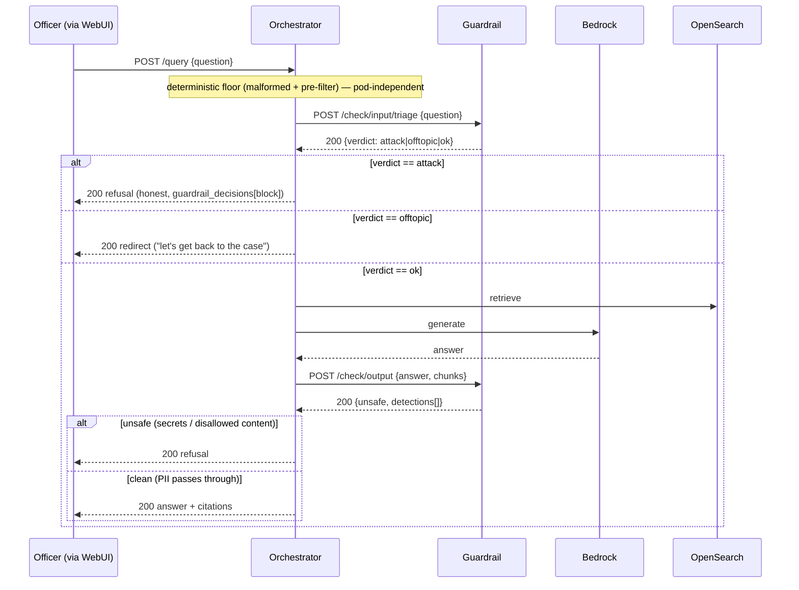
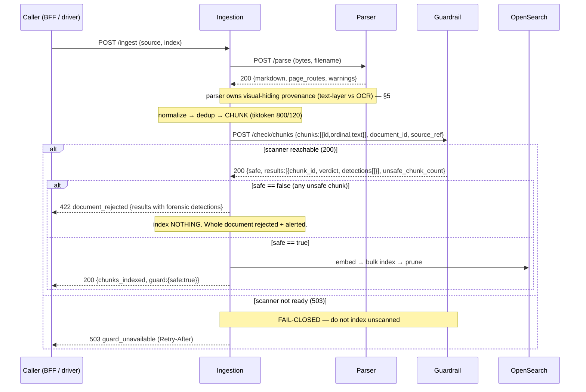

# Guardrail Service — topology

**Status:** as-built — request-time (orchestrator) + ingest-time (`/check/chunks`, built end-to-end: the
pod endpoint AND the ingestion call that consumes it; the ingestion call is opt-in via env) · **Scope:**
how the guardrail service sits between the other services and where each one calls it.
**Companion:** [guardrail-service-overview.md](guardrail-service-overview.md) · contracts
[guardrail-openapi.yaml](guardrail-openapi.yaml) (internal) / [guardrail-api.yaml](guardrail-api.yaml) (BFF)

The guardrail is one verdict-only pod with **two classes of caller**: the **orchestrator** at
request-time (guarding the officer's query and the generated answer) and the **ingestion** service at
ingest-time (guarding a document's parsed text before it enters the index). This doc shows both.

---

## 1. The services and their boundaries

Independent HTTP services, each with its own venv and a strict dependency firewall — **no service
imports another's Python.** Every guardrail call is HTTP-only over a location fact.

| Service | Role | Talks to the guardrail via | Wire fact |
|---|---|---|---|
| **Orchestrator** (`services/orchestrator`) | live `POST /query` pipeline: retrieve → generate → cite | `/check/input/triage`, `/check/output` | `ORCHESTRATOR_NEMO_GUARD_URL` |
| **Ingestion** (`services/ingestion`) | `POST /ingest`: fetch → parse → chunk → **guard** → embed → index | `/check/chunks` *(built; opt-in via env)* | `INGESTION_GUARDRAIL_URL` |
| **Parser** (`services/parser`) | document bytes → clean **Markdown** | — (does not call the guardrail; owns provenance, see §5) | called by ingestion via `INGESTION_PARSER_URL` |
| **Guardrail** (`services/guardrail`) | verdict-only NeMo pod (Bedrock Haiku) | — | — |

The orchestrator keeps the pod client behind a `typing.Protocol`, injected into a **pure** pipeline
stage — the `stages-pure` import contract forbids transport/NeMo imports in the stages. Ingestion wires
the guardrail exactly as it already wires the parser: a URL, HTTP-only, no import.

```
                          ┌─────────────────────────────┐
   request-time  ────────▶│                             │
   (orchestrator)         │      GUARDRAIL  (pod)        │
                          │   verdict-only · Bedrock     │
   ingest-time   ────────▶│   Haiku · fail-closed        │
   (ingestion)            │                             │
                          └─────────────────────────────┘
```

---

## 2. Request-time flow (orchestrator) — AS-BUILT

The officer asks a question; the orchestrator guards it on the way in and guards the answer on the way
out.

**Ordered pipeline (`_run_pre_generation` → generate → output rails):**

```
raw question
  → malformed pre-check (deterministic floor, NORMALIZE-ONCE)
  → regex pre-filter (deterministic; hard block if the pod is down)
  → /check/input/triage  →  ATTACK → block · OFF-TOPIC → redirect · OK → allow
  → deterministic rewrite → retrieval → generation
  → /check/output  →  secrets (deterministic, first) → case-officer content → optional grounding
  → answer
```



**Fail policy on this flow:** ATTACK adjudication unavailable → fail **CLOSED** (honest-200 refusal +
`Retry-After`); OFF-TOPIC unavailable → fail **OPEN** to OK; output unavailable → fail **CLOSED**. The
deterministic floor never participates in the failure — it is always enforcing.

**On/off comparison:** the WebUI Guardrails toggle selects the config. ON → guarded `1.8.0` (the flow
above). OFF → unguarded `1.2.0`, where `nemo_input_active` is false, so the triage and output calls are
skipped entirely and the question is answered as-is. This is the demo surface (see
`services/webui/GUARDRAILS_DEMO.md`).

---

## 3. Ingest-time flow (ingestion + parser) — BUILT end-to-end (ingestion call opt-in)

A document is submitted; the ingestion service parses it, chunks it, and guards **each chunk** before
any of it is allowed into the index. **Both halves are built:** the pod endpoint `POST /check/chunks`
(`services/guardrail`) and the ingestion call that consumes it (`services/ingestion/app/pipeline/guard.py`
+ `run.py`, config `guardrail_check_enabled` / `guardrail_url`). The ingestion call is **opt-in** —
`INGESTION_GUARDRAIL_CHECK_ENABLED` defaults **off** (so the offline ingestion suite makes no guard call)
and is turned **on** in the dev Makefile's `ingestion` target; production should enable it.

**Ordering caveat:** the guard runs at the **chunking** stage, which is *after* ingestion's pre-parse
**raw-bytes dedup gate**. Re-uploading a byte-identical document that is already fully indexed
short-circuits to "skipped" before parse/chunk, so the guard does not re-scan it — a poisoned file must
be scanned on its **first** ingest (or into a fresh index). This is correct for dedup but worth knowing
when demoing: upload the poisoned file to a fresh project, or delete the prior copy first.

**Ordered pipeline (`/ingest`):**

```
fetch → parse (parser: /parse → markdown) → normalize → dedup → chunk
      → /check/chunks (guardrail, per-chunk, AFTER chunking)
      → if safe:   embed → bulk index → prune
      → if unsafe: index NOTHING · reject whole document · alert frontend (which chunk, why)
```

Checking **per chunk** (not the whole markdown) is the deliberate choice: it yields the precise "which
part is unsafe" attribution the officer alert needs. The chunker's 120-token overlap covers most
boundary-spanning injections; the residual gap (an injection split cleanly across two non-overlapping
chunks) is an accepted, documented limitation of the attribution win.



**What `/check/chunks` does — deterministic, NO LLM call.** Each chunk is scanned with the pinned
`config/injections.yml` regex table: prompt-injection (IGNORE/override/reveal-system-prompt), jailbreak
(DAN, do-anything-now, developer-mode), AI-directive (instructions aimed at an AI reviewer; "mark this
entity compliant"; "do not flag discrepancies"), role-impersonation (all-caps `SYSTEM:` headers, chat
template tokens), and BIDI / zero-width / Unicode-tag smuggling. Because it needs no model, the verdict
survives a Bedrock outage at zero cost. Verdict per chunk: `safe` / `unsafe`; **any** unsafe chunk →
`safe:false` → the caller **rejects the whole document**. Patterns are written high-precision because
one hit rejects an entire document, and legal/tax documents are full of imperatives ("the Contractor
shall…"); an **optional** one-token Haiku rail for fluent evasions is config-gated and off. Each hit
carries a `char_span` + escaped `matched_excerpt` so the alert shows the officer exactly which text.

---

## 4. Why guard at both seams

The two flows defend different points against the **same** underlying threat — a poisoned document
steering an answer:

| Seam | Stops | Cost of stopping late |
|---|---|---|
| **Ingest-time** (`/check/chunks`) | a poisoned document **entering the index** | once indexed, it is retrievable context on *every* future query until re-ingested |
| **Request-time** (`/check/output`) | a poisoned chunk **reaching the officer** in an answer | the answer is already generated (paid); catches what slipped past ingestion |

Ingest-time is the cheaper, more complete place to stop poisoning — it is checked once per document,
not once per retrieval. Request-time output validation is the backstop for anything already in the
index or not yet guarded.

---

## 5. The parser / guardrail split (ingest-time)

The single most important boundary in the ingest flow, because it decides what the markdown check can
and cannot see:

> **By the time a document is markdown, the *visual-hiding* signal is gone.**

| Threat | Detectable in the markdown? | Owner |
|---|---|---|
| Injected **content** (AI-directed instructions, YARA payloads, invisible Unicode that survived extraction) | **Yes** | **Guardrail** (`/check/chunks`) |
| **Visual hiding** (zero-size / transparent fonts, off-canvas, colour-hidden, metadata-only text) | **No — destroyed at parse** | **Parser** (text-layer-vs-OCR diff, per-span provenance) |

The parser is the natural owner of provenance because it *has* the render layer: a text-layer-vs-OCR
diff (extracted text that does not appear in an OCR of the rendered page is text a human never saw) and
per-span font/colour/position metadata. A future extension can carry that provenance alongside each
chunk so the scan weights likely-hidden spans. **A green `/check/chunks` means "no injected content in
the text," not "no hidden text in the source"** — the two halves are separate and composable, and
neither alone is a complete document-injection defence.

---

## 6. Contracts

| Consumer | Contract | Auth |
|---|---|---|
| Orchestrator, ingestion (in-mesh) | [guardrail-openapi.yaml](guardrail-openapi.yaml) — the full internal service: `/check/input`, `/check/input/triage`, `/check/output`, `/check/chunks`, health | mTLS peer |
| BFF / UI (document verdict surface) | [guardrail-api.yaml](guardrail-api.yaml) — read guard outcomes on ingested documents; operator re-check | JWT Bearer, project-scoped |

The request-time input/output lanes are orchestrator-internal and appear only in the internal
(openapi) contract. The BFF contract exposes the document-verdict surface — the outcomes an officer or
operator sees on uploaded documents — not the raw rails.
