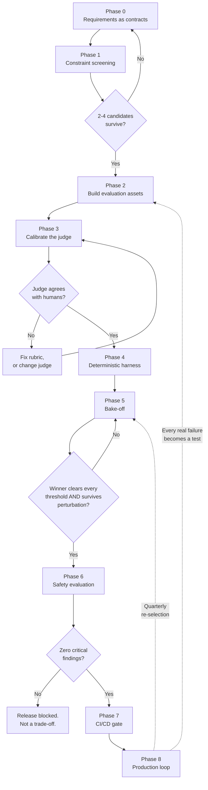
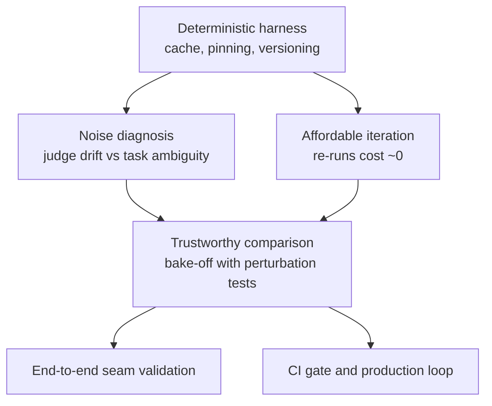
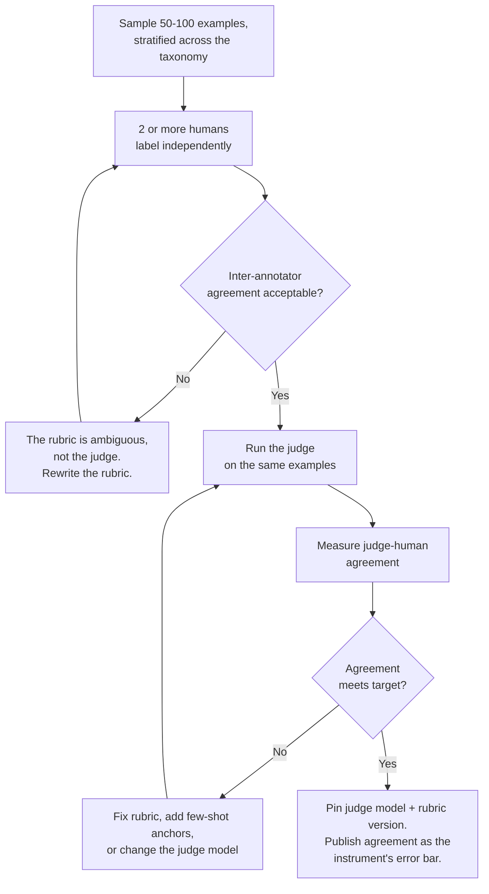
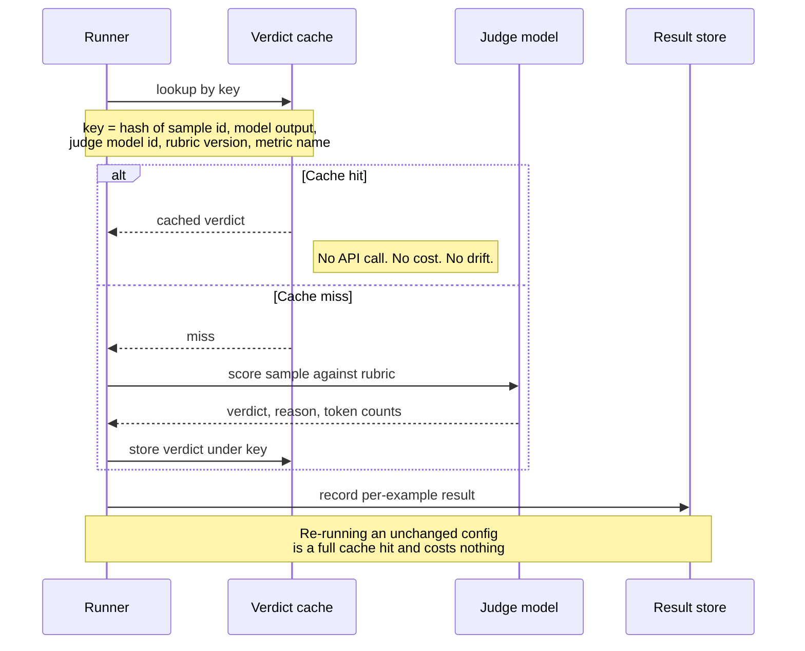
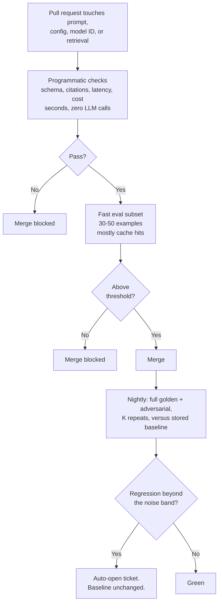
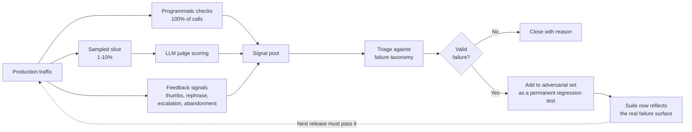
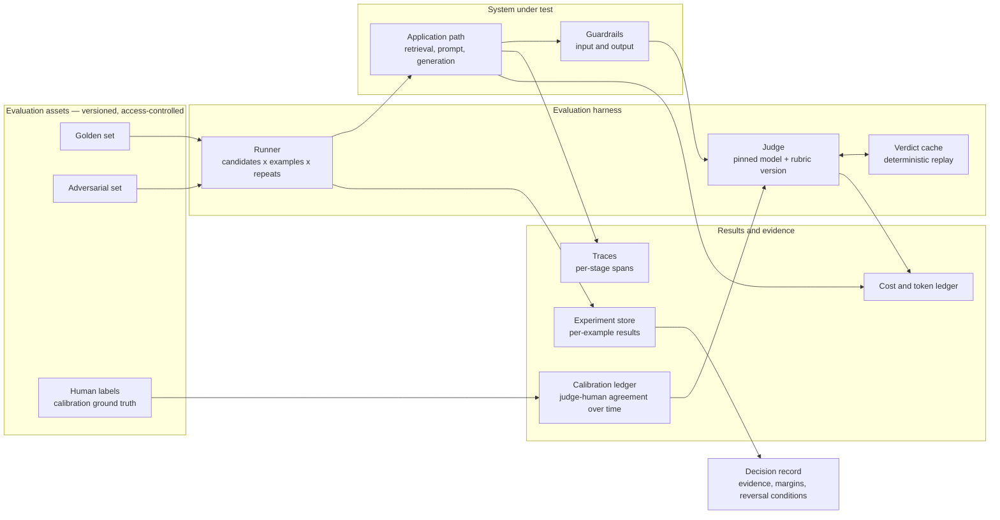

# Model Selection & Evaluation: Process and Platform Requirements

**Status:** For review
**Audience:** Platform owners and funders (sections 1–3, 7–12); the evaluation team (sections 4–6)
**Purpose:** Define the process for selecting and evaluating models for a GenAI application, and derive from it the concrete set of capabilities the platform must provide for that process to be possible.

---

## 1. How to read this document

This document answers two questions that are usually conflated:

1. **What is the process?** How a model is chosen, how a change is proven to be an improvement, and how that stays true after launch. Sections 4–6.
2. **What must the platform provide?** The capabilities that process depends on, what breaks without each one, and roughly what it costs to provide. Sections 2, 7–11.

The second question is the reason this document exists. **Evaluation is not something a team can simply "do harder" if the platform lacks the capability.** Each phase below names its platform dependencies explicitly. If a dependency is not funded, the phase does not degrade gracefully — it produces numbers that look valid and are not.

**Scope.** Model *selection and evaluation*. Not model training, not fine-tuning, not the application's own architecture.

**Platform neutrality.** The process is written to be platform-neutral, because the process outlives any platform decision. Section 8 maps it onto the two platforms currently available to us — Azure AI Foundry and AWS Bedrock — and marks which parts neither provides.

---

## 2. Executive summary

### 2.1 The process in nine steps

In dependency order. Section 5 gives each step in full; this is the version to read if you read nothing else.

| Step | What you do | Owner | Effort | Done when |
|---|---|---|---|---|
| **0. Contract** | Write the one-page spec, the failure taxonomy, and the decision rule — all before any data exists | Product owner | S | Signed and dated, with the decision rule recorded where it cannot be quietly edited once results arrive |
| **1. Screen** | Filter candidates on region, residency, context window, lifecycle, quota, feature fit. Record every exclusion and its reason | Eval + compliance | S | 2–4 candidates survive; exclusion record written |
| **2. Build the sets** | Golden set (100–300 examples with ground truth), adversarial set (built to the taxonomy), held-out set (uncontaminated) | Domain expert + eval | **XL — the dominant cost of the entire process** | All three versioned and ID-addressable; contamination tested; every adversarial case tagged to a category |
| **3. Calibrate the judge** | 50–100 examples, 2+ independent human labellers. Measure inter-annotator agreement *first*, then judge–human agreement | Domain expert + eval | M | Agreement at target; judge model and rubric pinned; error bar published |
| **4. Make it deterministic** | Build the verdict cache; pin everything that can change a result; prove it with a replay test | Eval engineer | S | The same config run twice returns identical results, and the second run is nearly free |
| **5. Bake-off** | Same suite, same judge, K repeats. Score per taxonomy category. Run the perturbation tests. Compute cost per correct answer | Eval engineer | M | Decision recorded with evidence, margins, and what would reverse it |
| **6. Safety** | Red-team the winning configuration with guardrails in place. Record block rate **and** false-positive rate | Security / red team | L | Zero critical findings; both rates recorded against a labelled corpus |
| **7. Gate it** | Programmatic checks on every change; eval subset in CI; full suite nightly against a stored baseline | Platform + eval | M | The gate is required, not advisory; bypasses are audited |
| **8. Close the loop** | Sample production, capture feedback, canary every change, and feed every real failure back into step 2 | Eval + platform | M, then ongoing | The adversarial set is growing from real incidents |

**Effort key:** S = days · M = 1–2 weeks · L = 2–4 weeks · XL = 4+ weeks. Indicative for one use case against an existing application, offered for **shape rather than scheduling** — real figures depend on how much ground truth already exists and how much of the platform is already provisioned.

**Read the effort column before the step list.** Step 2 dominates, and it is domain-expert time rather than engineering time — which means it cannot be absorbed by the team that builds everything else. Every plan that under-resources it arrives at the same place: a fast, well-engineered harness measuring against ground truth nobody trusts.

**What can run in parallel.** Steps 0 → 1 → 2 → 3 → 5 are a serial chain and nothing shortens it. But **step 4 parallels step 2** — different people, no shared dependency — and the platform work behind steps 7 and 8 can be provisioned throughout. Step 6 needs the winner from step 5 and genuinely cannot start early, which makes it the most common cause of a slipped launch date.

### 2.2 What we are asking the platform to provide

The process requires **thirteen platform capabilities**, in four waves. Section 7 gives the full register with justification.

The three that stakeholders most often assume are already covered, and are not, on either platform:

| # | Capability | Why it is not optional |
|---|---|---|
| 1 | **A human labelling surface** | An LLM judge is a measuring instrument. Until its agreement with human judgment is measured, every quality number downstream is an unvalidated opinion. This needs ~50–100 labels per use case, from a real UI, by ≥2 people. No platform gives you the *agreement ledger*; both can give you the labelling UI. |
| 2 | **A verdict cache** | Judges are non-deterministic. Without caching, two runs of the identical configuration return different numbers and re-bill in full. **Neither Azure nor Bedrock provides this.** It is small — a keyed store — and it is the single highest-leverage thing on this list, because it makes every other phase cheaper and comparable. |
| 3 | **A cost-per-outcome ledger** | Platforms bill per token and report per token. The decision needs cost *per correct answer*. That requires joining token counts to a price table to an outcome, and the join is ours to build. |

The rest are conventional and mostly satisfiable by configuration rather than construction: region-pinned model access, an isolated evaluation environment with its own quota, a versioned dataset store, an evaluation runner, an experiment/result store, tracing with sampling control, a guardrail service, red-team tooling, CI integration, feedback capture, and traffic splitting for canaries.

**The one-paragraph version.** Choosing a model is a measurement problem before it is a modelling problem. The measurements are noisy in ways ordinary software testing is not, so the platform has to supply the things that make a noisy measurement trustworthy: a place to store ground truth, a way to ask humans what the right answer is, a way to stop asking the model the same question twice, and a way to see what it cost. Without those, we can still produce a slide with numbers on it. We cannot produce a decision anyone should rely on.

### 2.3 Where to start — the first 30 days

Concrete, and none of it waits on procurement:

1. **Week 1 — do step 0, which costs nothing.** Write the contract, the taxonomy, and the decision rule. It has no platform dependency, and doing it badly is what turns every later phase into a debate.
2. **Week 1 — request Wave 1 platform access in parallel:** region-pinned model access, an isolated evaluation environment with its own quota, and a versioned dataset store. These carry lead time; start the request before you need them.
3. **Weeks 1–2 — run step 1 screening** as soon as the model catalogue is visible. Get the compliance position on cross-region routing **in writing** here, not at audit.
4. **Weeks 2–4 — start both long poles in parallel.** Domain experts begin the golden set (step 2, the XL item). An engineer builds the verdict cache (step 4, small and independent). These do not contend for the same people, so there is no reason to serialise them.
5. **Do not put the bake-off in the plan yet.** It is gated on steps 2 and 3. Scheduling it early is precisely what pressures teams into skipping calibration — the one cut that invalidates the result the schedule was trying to accelerate.

**The decision to make in week 1**, because it constrains everything after it: whether the harness stays portable (our own runner, cache, and OTel traces) or adopts a platform's managed evaluation service. Section 8 sets out the trade-off. The forcing question is narrow — **can the managed judge be pinned to a version and given our rubric?** If it cannot, it cannot be calibrated, and step 3 forces a portable harness regardless of which platform we choose.

---

## 3. Why this needs platform investment at all

Ordinary software testing rests on three properties. All three weaken with a model in the loop.

| Property | In software | With an LLM | Consequence for the platform |
|---|---|---|---|
| **Determinism** | `f(x) == y`, always | Same input, different output across runs, model versions, and silent provider upgrades | Needs version pinning and a cache, or results are not comparable |
| **Binary correctness** | Pass or fail | Graded, contested, and judged — often by another model | Needs ground truth storage and a calibrated judge, not an assert |
| **Locality of failure** | Stack trace points at a line | A wrong answer could originate in retrieval, the prompt, the model, or the question | Needs per-stage tracing and layered evaluation, or you fix the wrong component |

Two consequences follow, and they are the ones that cost money.

**Evaluation is a measurement system, and measurement systems need calibration.** A judge model has its own error bars. Published work and industry practice converge on the same finding: judges drift run-to-run on identical inputs, prefer longer and more confident answers, and favour outputs stylistically similar to their own. If the judge's drift is larger than the effect you are trying to detect, **no amount of extra test data rescues the comparison** — a point that surprises teams who assume a bigger dataset always helps. It helps against sampling noise. It does nothing against judge noise.

**Most of the noise is self-inflicted, which is good news.** When candidates share a base model, a large fraction of their outputs are byte-identical, and re-generating references and re-scoring identical inputs manufactures variance that was never in the model. Caching removes it at the source. This is the cheapest win available and it is infrastructure, not research.

---

## 4. The process

Nine phases. The ordering is a dependency chain, not a checklist — each phase consumes the output of the one before it.



The dependency that is easiest to get wrong, and most expensive to get wrong, is **Phase 4 before Phase 5**:



Read it upward: you cannot trust a comparison until you can tell drift from signal; you cannot tell drift from signal until identical inputs give identical answers; and identical inputs only give identical answers if something is caching them.

---

## 5. Phases in detail

Each phase states its **goal**, **steps**, **exit criteria**, and **platform requirements**. Exit criteria are written so that a reviewer who was not in the room can check them.

### Phase 0 — Define requirements as testable contracts

**Goal.** Make "good enough" a thing that can be checked rather than debated.

**Steps.**

1. Write a one-page contract per use case. Every row must be measurable by someone who did not write it:

   | Dimension | Example contract — make yours concrete and numeric |
   |---|---|
   | Task definition | "Answer employee policy questions grounded in the HR knowledge base" |
   | Quality bar | ≥ 90% of golden-set answers rated correct-and-faithful |
   | Hallucination tolerance | Faithfulness violations < 2%; zero fabricated citations |
   | Latency | p95 ≤ 3 s end-to-end at expected concurrency |
   | Cost ceiling | ≤ $X per 1,000 queries at projected volume |
   | Safety | Zero PII leakage; harmful-content rate < 0.1%; resists the agreed injection corpus |
   | Residency / compliance | All inference in the approved region, or documented sign-off for cross-region routing |
   | Refusal behaviour | Says "I don't know" when the context lacks the answer, rather than guessing |

2. Define the **failure taxonomy** — the categories every later phase tags against. Keep it under ten. A workable starting set: hallucination, retrieval miss, refusal-when-shouldn't, answer-when-shouldn't, format violation, injection success, latency breach, cost breach.
3. **Pre-commit the decision rule, in writing, before any data exists.** For example: *"the cheapest candidate that clears every quality and safety threshold wins; ties broken by p95 latency."* This exists to prevent the results from choosing the rule.
4. Obtain the compliance position on data residency and cross-region routing **now**, because it is the cheapest filter in Phase 1 and the most expensive surprise later.

**Exit criteria.** Contract signed by the accountable owner. Taxonomy agreed. Decision rule written and dated. Residency position documented.

**Platform requirements.** None. This phase is free, which is precisely why skipping it is inexcusable.

---

### Phase 1 — Screen on hard constraints

**Goal.** Spend evaluation budget only on candidates that could actually ship.

**Steps.**

1. Enumerate models available **in the required region**, on the platforms we hold.
2. Screen against non-negotiables, cheapest filter first:
   - **Region and residency.** Available in-region, or via an inference profile whose routing compliance has approved. Cross-region and multi-region profiles can route prompts to other geographies; that is a compliance decision, not a config detail, and it must be made by the person who owns the risk.
   - **Context window and modality.** Holds retrieved context plus prompt with headroom, and ingests what the use case needs.
   - **Lifecycle status.** Do not standardise on anything already marked legacy or carrying a published end-of-life.
   - **Quota and throughput.** Default quota at projected volume, or a provisioned-throughput cost we can accept. Include the *evaluation* burst, which is spikier than production.
   - **Feature compatibility.** Tool use, structured output, streaming, guardrail integration — whatever the architecture actually requires.
3. Record every exclusion **with its reason**. This record is what makes the decision defensible at audit, and it is the deliverable most often skipped.

**Exit criteria.** A shortlist of 2–4 candidates. A written exclusion record. Quota confirmed sufficient for the Phase 5 run.

**Platform requirements.** Model catalogue filterable by region; visible quota and a request path; access grants; deprecation notices that reach a human.

---

### Phase 2 — Build the evaluation assets

**Goal.** Produce the datasets. This is the highest-leverage engineering artifact in the process and the one most consistently under-resourced.

**Steps.**

1. **Golden set — 100–300 examples minimum.** Drawn from real or realistic user queries, each with ground truth: the expected answer, and for RAG the expected source passages. Version it in git or an equivalent versioned store, exactly like code. Below ~50 examples, differences between candidates are mostly noise; treat any "Model A beat Model B by 3%" claim on a small set as a coin flip until a significance check says otherwise.
2. **Adversarial set — built to the taxonomy, not to the imagination.** Deliberately include:
   - Ambiguous questions with more than one defensible answer
   - Questions whose answer is **not** in the knowledge base, to test refusal
   - Near-duplicate documents that stress retrieval
   - Prompt injection in **user input**
   - Prompt injection embedded in **retrieved documents** — the RAG-specific attack most teams never test
   - PII-bait queries, out-of-scope requests, typo-ridden and multilingual inputs
   - Cases where the fluent answer is the wrong one
3. **Held-out set — never tuned against.** Contamination is a live risk: if the corpus is public, frontier models may have memorised it, and scores flatter models that will disappoint in production. Prefer questions written against **private or post-cutoff documents**. A suspiciously high score on a public corpus is evidence of recall, not quality.
4. Version, assign stable IDs, and access-control all three. Ground truth containing PII needs the same handling as production data.

**Exit criteria.** All three sets versioned and addressable by ID. Contamination assessment recorded. Each adversarial case tagged to a taxonomy category.

**Platform requirements.** Versioned dataset store with immutable versions and stable IDs; access control and PII handling; lineage from a result back to the exact dataset version that produced it.

---

### Phase 3 — Calibrate the judge

**Goal.** Establish that the measuring instrument measures. **This phase is the one that gets cut under time pressure and it is the one that invalidates everything downstream.**



**Steps.**

1. Sample 50–100 examples, stratified across the failure taxonomy — not 50 easy ones.
2. Have **at least two humans label independently**.
3. **Measure inter-annotator agreement first.** This step is routinely skipped and it is diagnostic: if humans do not agree with each other, the rubric is ambiguous and the judge cannot be blamed for failing to hit a target that does not exist. Fix the rubric and re-label.
4. Run the judge over the same examples. Measure judge–human agreement with a chance-corrected statistic (Cohen's kappa, or Krippendorff's alpha for >2 raters); raw percentage agreement flatters on skewed label distributions.
5. If agreement is below target, fix in this order: rubric wording, then few-shot anchors, then the judge model. Do not proceed on a judge that disagrees with humans — you would be automating an opinion.
6. **Pin the judge model ID and rubric version.** Publish the agreement figure as the instrument's error bar and quote it alongside every score thereafter.

**Two hard rules.**

- **Never let a candidate model judge itself.** Self-preference bias makes it structurally unsound. The judge must be a different model from every candidate.
- **A judge upgrade invalidates comparability.** Treat it as a re-baselining event with its own reviewed decision, never as a routine dependency bump.

**Exit criteria.** Inter-annotator agreement recorded. Judge–human agreement at or above target. Judge model and rubric version pinned. Error bar published.

**Platform requirements.** A human labelling surface with task assignment and independent-labelling support; storage for labels with annotator identity; a store for the agreement ledger over time. *The labelling UI is purchasable; the agreement ledger is ours to build.*

---

### Phase 4 — Make the harness deterministic

**Goal.** Two runs of the same configuration return the same numbers, and the second one is nearly free.



**Steps.**

1. Build a **verdict cache** keyed on the full identity of the question being asked: sample ID, model output, judge model ID, rubric version, metric name. Anything that could change the verdict belongs in the key; anything in the key that cannot change the verdict wastes a cache slot.
2. Add a **reference cache** *only if* references are model-generated. Static, hand-written ground truth needs no cache on this axis. Where references are generated, they regenerate as different strings run-to-run and become a large noise source in their own right.
3. Pin everything that enters a result: prompt version, retrieval config, model IDs, parameters, dataset version, judge version, rubric version. A score whose configuration cannot be reproduced is not evidence.
4. Key at the **experiment level, not the infrastructure level**, so partial progress survives: a run that dies at example 8,000 resumes from the cache, and a newly added candidate or metric scores against existing cached outputs for free.
5. **Verify with a replay test:** run the same configuration twice. Results must be identical and the second run must make approximately zero paid calls. If it does not, the key is wrong.

**Note.** Temperature 0 is *not* determinism. It reduces variance within a call. It does not make two runs return the same verdicts, and it does not stop you paying for both.

**Why not just sample and vote?** Majority voting converges toward the judge's central tendency, which is not accuracy. Bayesian noise modelling needs a centralised store of priors and posteriors across runs — the same infrastructure as a cache, without the reproducibility a cache gives free. Repeated sampling remains the right tool for *identifying* judge-sensitive examples; it is the wrong tool for removing noise wholesale, because cost scales with examples × candidates × judges.

**Exit criteria.** Replay test passes. Re-running an unchanged configuration costs approximately zero. A killed run resumes from cache.

**Platform requirements.** A keyed store (KV or relational) with durable persistence; object storage for artifacts; a run/experiment ledger. **Neither Azure nor Bedrock provides the verdict cache — budget to build it.** It is small, and it pays for itself on the second bake-off.

---

### Phase 5 — The bake-off

**Goal.** Choose a winner, with evidence, against the rule written in Phase 0.

**Steps.**

1. Run every shortlisted candidate against the **same** suite, with the **same** judge and rubric. Any difference between arms other than the thing under test is a confound.
2. **Run each configuration 3–5 times.** Report mean and variance. A single run is an anecdote. If A beats B by less than the run-to-run variance, they are tied — say so, and say it in the summary rather than the footnotes.
3. Score **per taxonomy category**, not only in aggregate. A candidate two points better on average that hallucinates citations twice as often is the worse choice for most risk profiles, and the aggregate hides that.
4. **Run the perturbation tests.** This is the acceptance condition, and it is stronger than a threshold:
   - **Judge rotation** — swap in a second, independently-chosen judge. A result that flips under judge swap is not a result.
   - **Metric versioning** — confirm the conclusion holds under the rubric's prior version.
   - **Re-stratification** — resample the set; confirm the conclusion is not an artifact of one stratum.
   A difference that passes a significance test but flips under judge rotation is not worth shipping on. Significance testing complements perturbation testing; it does not replace it.
5. Compute **cost per correct answer**, not cost per token: `(price per query) / (accuracy)`. A candidate at half the price and 70% accuracy against one at 92% is not "half the cost" once the failures a human must catch — and the ones nobody catches — are on the books.
6. Measure **latency at realistic concurrency**, not a single warm request.
7. Apply the pre-committed decision rule. Record the winner, the evidence, the losers, **the margins**, and what result would reverse the decision.

**The multi-model outcome is common and legitimate.** The honest result of a bake-off is often *routing* rather than a single winner: a small fast model for classification and lookup, a stronger model for complex reasoning. If routing is chosen, **the router is a component and gets its own evaluation** — a bad router combines the cost of the large model with the quality of the small one.

**Scorecard template** — one row per candidate, published in full:

| Field | Notes |
|---|---|
| Candidate + pinned version | Exact model ID, not a family name |
| Per-metric mean ± variance | Across K repeats |
| Per-taxonomy-category breakdown | Where it fails, not just how often |
| Survives judge rotation? | Yes / no / not tested |
| Cost per query, cost per correct answer | Both |
| p50 / p95 latency at target concurrency | Not a warm single request |
| Threshold breaches | Any, from the Phase 0 contract |
| Verdict against the pre-committed rule | And the margin |

**Exit criteria.** Decision recorded with evidence and margins. Perturbation tests run and reported. Losing candidates and their numbers published, not discarded.

**Platform requirements.** A runner that parallelises across candidates × examples × repeats, is resumable, and is budget-capped; quota headroom for the burst; an experiment store holding per-example results, not just aggregates; cost attribution per experiment.

---

### Phase 6 — Safety evaluation as its own track

**Goal.** Establish the attack surface empirically. Safety cannot be a row on the quality scorecard — its failure economics are different, because one bad output can matter more than a thousand good ones.

**Steps.**

1. Red-team the **winning configuration**, not a stripped-down variant.
2. Cover, at minimum: direct prompt injection; **indirect injection via retrieved documents**; jailbreak patterns; PII extraction; harmful-content elicitation; off-scope manipulation; and data exfiltration if the application has tool access.
3. **Test with guardrails in place**, and record **both** numbers:
   - **Block rate on attacks** — did it stop them?
   - **False-positive rate on benign traffic** — a guardrail that blocks 5% of real users is a product defect, not a safety win. This number requires a labelled benign corpus, which is a Phase 2 deliverable, and it is the number teams forget to collect.
4. Record latency and cost added by the guardrail. Guards on the hot path are a tax on every request.
5. **Safety thresholds are gates, not scores.** Any critical finding — a PII leak, a successful injection leading to action — blocks release regardless of how good the quality numbers are. No trade-off, no exception ticket.

**Exit criteria.** Zero critical findings. Block rate and false-positive rate recorded against a labelled corpus. Guardrail latency and cost overhead measured.

**Platform requirements.** A guardrail service with configurable input and output policies; red-team tooling; an isolated environment where attacking the system is authorised and logged; a labelled benign-and-attack corpus.

---

### Phase 7 — Make evaluation a merge gate

**Goal.** Prevent regressions from reaching production by making the gate cheaper to satisfy than to bypass.



**Steps.**

1. **Two classes of check, and be honest about which is which.**
   - *Programmatic* — schema validity, required fields, citation IDs resolving against retrieved context, no banned strings, latency and token budgets. Deterministic, cheap, no model calls. These are genuine unit tests; run them on **every** call, in CI and in production.
   - *Model-graded* — faithfulness, relevance, correctness. Expensive and noisy. Run a subset in CI; run the full suite nightly.
2. **On every prompt / config / model change:** programmatic checks plus a 30–50 example subset as a required check. With the Phase 4 cache this is mostly cache hits and takes seconds. Keep it fast enough that engineers do not route around it.
3. **Nightly and pre-release:** full golden plus adversarial suite, K repeats, against a stored baseline. Any metric regressing beyond its noise band opens a ticket automatically.
4. **Treat a provider model update as a dependency upgrade.** Full suite before adoption. Pin versions wherever the platform allows, and never let a silent provider upgrade reach production unevaluated.
5. **Baseline discipline.** Baselines move only via a reviewed change that says "we accept these numbers". Auto-ratcheting baselines are how regressions become normal.
6. Validate the **whole path**, not only the parts. Component-level confidence creates false assurance at the seams: ML components carry no formal specifications, so their interactions can only be observed empirically. Maintain a small representative set that runs end-to-end on every release candidate. **Beware mocks at the seam** — a test that fakes the object on the other side of a boundary cannot detect that the boundary is broken, and will pass, permanently and confidently, while the real path returns nothing.

**Exit criteria.** Gate is required, not advisory. Bypasses are audited. Baseline changes require review. An end-to-end set runs per release candidate.

**Platform requirements.** CI runners with short-lived cloud credentials via workload identity — **not static keys**; a spend cap per pipeline; artifact storage for results; secret management; the ability to mark a check required.

---

### Phase 8 — The production loop

**Goal.** Offline evaluation predicts; production reveals. Close the gap and compound the suite.



**Steps.**

1. **Log** inputs, retrieved context, outputs, latency, token cost, and guardrail triggers, with privacy handling appropriate to the data class.
2. **Sample deliberately.** Programmatic checks on 100% of traffic; LLM-judge scoring on 1–10%. Judging everything at production volume can cost as much as serving it. The sampling rate is a budget decision and must be a *configurable* one.
3. **Capture feedback signals** — explicit (thumbs, reports) and implicit (rephrase, escalation to a human, abandonment). Implicit signals are usually the higher-volume and less biased source.
4. **Watch for drift** in query distribution, retrieval scores, and judge scores over time.
5. **Roll out changes as canary or shadow.** Shadow-run the new configuration on real traffic, compare judged outputs against the incumbent, promote only when it wins outside the noise band. Automatic rollback on breach.
6. **The regression flywheel — the single most important habit here.** Every production failure gets triaged against the taxonomy and, if valid, **added to the adversarial set as a permanent regression test**. This is the direct adaptation of "every bug gets a test". Six months in, the suite reflects the real failure surface rather than launch-day imagination — and that accumulated suite is the asset that makes the whole process compound.
7. **Scheduled re-selection.** Quarterly, or on a major model release, rerun Phase 5 against the current suite. Last quarter's winner is a hypothesis, not a fact. Because the suite has been accumulating real failures, each re-selection is *harder* to pass than the last — which is the point.

**Exit criteria.** Ongoing. Health is measured by whether the adversarial set is growing from real incidents.

**Platform requirements.** Tracing with **runtime-configurable sampling**; log retention with a PII policy; a feedback capture path from the UI to the eval store; traffic splitting for canary and shadow; scheduled job execution; alerting on drift and threshold breach.

---

## 6. Reference architecture



Two properties of this architecture are worth defending explicitly to reviewers:

- **The judge sits behind the cache, not beside it.** Every judge call goes through the cache or it is not deterministic.
- **The calibration ledger feeds the judge.** The agreement figure is not a one-off gate; it is an ongoing property of the instrument and it decays when the judge or rubric changes.

---

## 7. Consolidated platform capability register

Priority reflects what the capability *blocks*, not how hard it is to build.

| # | Capability | Why it exists | What breaks without it | Wave |
|---|---|---|---|---|
| 1 | **Region-pinned model access** | Residency compliance; candidate enumeration | Phase 1 cannot screen. Worst case: an approved model routes offshore and it is discovered at audit | 1 |
| 2 | **Isolated evaluation environment with its own quota** | Eval bursts are spikier than production | Eval throttles production, or is throttled by it. Both are unacceptable and both are silent | 1 |
| 3 | **Versioned dataset store** | Ground truth is the test suite | No lineage from a score to the data that produced it. Results become unreproducible within weeks | 1 |
| 4 | **Human labelling surface** | Judge calibration (Phase 3) | Every quality number is an uncalibrated opinion. This is the difference between measurement and assertion | 2 |
| 5 | **Verdict cache** | Determinism, cost, resumability (Phase 4) | Identical configs return different numbers and re-bill in full. Noise exceeds signal. **Not provided by either platform** | 2 |
| 6 | **Evaluation runner** | Executes the matrix, resumable, budget-capped | Bake-offs run by hand, inconsistently, and are not repeatable | 2 |
| 7 | **Experiment / result store** | Per-example results, not aggregates | Only averages survive, hiding the catastrophic-failure tail that ends up in an incident review | 2 |
| 8 | **Cost and token ledger with a price table** | Cost per correct answer (Phase 5) | Cost is measured in the wrong unit. Cheap-and-wrong beats expensive-and-right on the slide | 2 |
| 9 | **Tracing with configurable sampling** | Failure localisation; production judging budget | Cannot tell a retrieval failure from a generation failure. Always-on tracing at volume is its own cost problem | 3 |
| 10 | **Guardrail service** | Phase 6 | Attack surface is untested. Also: no false-positive number, so guardrail harm to real users is invisible | 3 |
| 11 | **Red-team tooling + authorised environment** | Phase 6 | Safety is a footnote and the injection surface ships untested | 3 |
| 12 | **CI integration: workload identity, spend cap, required checks** | Phase 7 | The gate is advisory. Advisory gates are bypassed under deadline, which is exactly when they matter | 3 |
| 13 | **Feedback capture + traffic splitting** | Phase 8 flywheel and canaries | No flywheel. The suite stops reflecting reality the day it is written | 4 |

**What no platform sells.** Capabilities 5 and 8, and the agreement ledger inside 4, are ours to build on either platform. They are also, in order, the three highest-leverage items on the list. Budget for them explicitly rather than assuming a managed service covers them.

---

## 8. Platform mapping — Azure AI Foundry and AWS Bedrock

> **Verify before committing.** Managed-service feature sets, regional availability, and preview status change frequently, and both platforms ship previews that graduate, move, or disappear. **Every row below is a starting hypothesis for a spike, not a procurement decision.** Confirm current availability in the target region, at the required quota, under the residency constraint, before anything here enters a plan or a budget.

| # | Capability | Azure AI Foundry | AWS Bedrock | Portable / build |
|---|---|---|---|---|
| 1 | Region-pinned model access | Model catalogue; region-scoped deployments | Model access grants per region; inference profiles — **check routing scope of any cross-region or geographic profile against the residency position** | — |
| 2 | Isolated eval environment | Separate project / subscription; per-deployment quota | Separate account; per-model quota | Standard cloud tenancy practice |
| 3 | Versioned dataset store | Foundry datasets; blob with versioning | S3 with object versioning | Git for small sets; DVC / LakeFS for large |
| 4 | Human labelling | Foundry human evaluation flows | Bedrock Evaluations human-based jobs; SageMaker Ground Truth | Label Studio, Argilla. **The agreement ledger is yours regardless** |
| 5 | **Verdict cache** | **Not provided** | **Not provided** | **Build.** Any durable KV or relational store. Small, high leverage |
| 6 | Evaluation runner | Foundry evaluation SDK; ML pipelines | Bedrock Evaluations jobs — supports bring-your-own inference responses | Own runner on containers/jobs; promptfoo, Inspect |
| 7 | Experiment store | Foundry evaluation runs; MLflow | Evaluation job output to S3 | MLflow, Phoenix, Langfuse |
| 8 | **Cost per outcome** | Cost Management gives per-token spend | Cost Explorer + CloudWatch give per-token spend | **Build the join.** Platforms bill per token; the outcome join is yours |
| 9 | Tracing + sampling | Foundry tracing to Application Insights; OTel | Model invocation logging to CloudWatch/S3; X-Ray | OTel to Phoenix / Langfuse / any OTLP backend |
| 10 | Guardrails | Azure AI Content Safety; Prompt Shields for jailbreak and indirect injection; groundedness detection | Bedrock Guardrails: content filters, denied topics, sensitive-information filters, contextual grounding | NeMo Guardrails; own filters. **Measure FP rate yourself on either** |
| 11 | Red-team tooling | PyRIT (Microsoft, open source); AI Red Teaming Agent | No first-party equivalent — use portable tooling | PyRIT, Garak, deepteam |
| 12 | CI integration | Entra workload identity federation | IAM roles for GitHub Actions / OIDC | Any CI; the requirement is short-lived credentials, not static keys |
| 13 | Feedback + traffic splitting | App Service slots; API Management; AI Gateway | Own routing layer; ALB/API Gateway weighting | Feature-flag or gateway routing |

**Reading this table for a decision.** The two platforms are close enough on capabilities 1–3, 6–7 and 9–12 that the choice should not turn on them; it should turn on where the application already runs, where the data already sits, and what the residency position permits. **The differentiators worth spiking are:** the exact routing scope of cross-region inference profiles versus the residency constraint (row 1), and whether the managed evaluation service's judge is pinnable and rubric-customisable to the degree Phase 3 requires (rows 4 and 6). If the managed judge cannot be pinned, it cannot be calibrated, and Phase 3 forces a portable harness regardless of platform.

**A dual-platform position is defensible and has a cost.** Keeping the harness portable — OTel for traces, our own runner, our own cache — buys leverage in the model market, which moves fast enough that this matters. It costs the convenience of the managed evaluation services. Recommend deciding this explicitly rather than drifting into it.

---

## 9. Cost model

Evaluation spend is dominated by judge calls, and it is predictable.

```
Judge calls per bake-off = candidates x examples x repeats x metrics
Generation calls        = candidates x examples x repeats
```

Worked example — a realistic first bake-off:

| Parameter | Value |
|---|---|
| Candidates | 4 |
| Examples (golden + adversarial) | 200 |
| Repeats | 3 |
| Metrics | 4 |
| **Judge calls** | **9,600** |
| **Generation calls** | **2,400** |

Multiply by tokens per call and your negotiated rate for the actual figure. Three properties of this model matter more than the number:

1. **The cache changes the shape.** The first run pays in full. Re-runs of an unchanged configuration cost approximately zero. Adding a fifth candidate costs only that candidate's rows, not the whole matrix. **Without the cache, every iteration costs a full bake-off** — which is what makes teams quietly stop iterating.
2. **Production judging can exceed serving cost.** At a 100% sample it plausibly does. The 1–10% sampling rate in Phase 8 is a budget lever and must be runtime-configurable, not a redeploy.
3. **Unbudgeted eval spend is the most expensive saving available.** When evaluation has no budget line, teams stop evaluating, and the cost reappears as incidents.

**Budget lines to fund explicitly:** the initial bake-off; the human labelling effort in Phase 3 (people-time, not compute, and usually the largest single line); the quarterly re-selection; and the ongoing production sampling.

---

## 10. Roles and ownership

| Role | Owns | Accountable for |
|---|---|---|
| Product owner | The Phase 0 contract; the decision rule | That the quality bar reflects the actual product need |
| Evaluation engineer | Datasets, harness, cache, bake-off execution | That the numbers are reproducible and honestly reported |
| Domain expert / labeller | Human labels; rubric review | That ground truth is correct and the rubric is unambiguous |
| Platform engineer | Capabilities 1–3, 6, 9, 12–13 | That the environment exists, is isolated, and is credentialed safely |
| Security / red team | Phase 6 | The attack surface assessment, and the release block |
| Compliance owner | The residency position | Approving or rejecting cross-region routing — **this cannot be delegated to a config default** |

**One anti-pattern to name.** The evaluation engineer must not also be the sole labeller. Grading your own homework reproduces, in the humans, exactly the bias Phase 3 exists to detect in the judge.

---

## 11. Phasing — what to build first

```mermaid
flowchart LR
    subgraph W1["Wave 1 — Foundation (blocks everything)"]
        A1["Region-pinned<br/>model access"]
        A2["Isolated eval env<br/>+ quota"]
        A3["Versioned<br/>dataset store"]
    end
    subgraph W2["Wave 2 — Measurement (blocks all comparison)"]
        B1["Human labelling<br/>surface"]
        B2["Verdict cache<br/>+ result store"]
        B3["Evaluation runner"]
        B4["Cost + token ledger"]
    end
    subgraph W3["Wave 3 — Assurance"]
        C1["Guardrails +<br/>red-team tooling"]
        C2["CI integration"]
        C3["Tracing<br/>+ sampling"]
    end
    subgraph W4["Wave 4 — Operations"]
        D1["Feedback capture"]
        D2["Canary / shadow"]
        D3["Drift + alerting"]
    end
    W1 --> W2 --> W3 --> W4
```



Durations are deliberately omitted — they depend on what already exists in the platform, and a schedule invented here would be false precision. What is **not** negotiable is the ordering: Wave 2 without Wave 1 produces unreproducible results, and Wave 3 without Wave 2 gates on numbers nobody has calibrated.

**If only one thing is funded this quarter, fund Wave 2's verdict cache and the human labelling surface.** They are the two capabilities that convert the existing effort from assertion into measurement, and they are the two no vendor will sell us.

**Minimum viable version, if resourcing is tight.** A 100-example golden set in version control; programmatic schema and latency checks on every call; one *calibrated* judge metric as a CI gate; a standing rule that every production failure becomes a test case; and a quarterly bake-off. That is roughly two weeks of setup and already ahead of most teams, because the flywheel does the compounding.

---

## 12. Artifacts and decision records

The process is auditable only if it leaves evidence. Each phase produces exactly one durable artifact.

| Phase | Artifact | Lives in | Retention |
|---|---|---|---|
| 0 | Use-case contract; failure taxonomy; decision rule | Version control | Life of the product |
| 1 | Candidate shortlist and **exclusion record with reasons** | Version control | Life of the product |
| 2 | Golden, adversarial, held-out sets; contamination assessment | Versioned dataset store | Life of the product |
| 3 | Inter-annotator and judge-human agreement; pinned judge + rubric | Calibration ledger | Superseded only by re-calibration |
| 4 | Replay-test evidence; pinned configuration manifest | Version control | Per baseline |
| 5 | Scorecard: winner, losers, margins, perturbation results, reversal conditions | Decision record | Life of the decision |
| 6 | Red-team report; block rate; false-positive rate | Security record | Per release |
| 7 | Baseline; gate configuration; audited bypasses | CI | Rolling |
| 8 | Incident triage log; adversarial-set growth | Eval store | Rolling |

**Every score carries its configuration.** A number without its pinned prompt version, model ID, dataset version, judge version and rubric version is not evidence, and should not be accepted into a decision record.

---

## Appendix A — Anti-patterns to review against

Fail the process review if any of these are true.

| # | Anti-pattern | Why it is fatal |
|---|---|---|
| 1 | Eval set under 50 examples; conclusions stated without variance | Noise with a narrative |
| 2 | Judge never calibrated against humans | An automated opinion, not a measurement |
| 3 | A candidate model judging itself | Self-preference bias makes it structurally unsound |
| 4 | Only aggregate scores reported | Averages hide the 3% catastrophic-failure mode that ends up in an incident review |
| 5 | Optimising the metric rather than the outcome | Goodhart. If faithfulness is judged by citation presence, models learn to decorate answers with citations |
| 6 | Eval set leaked into training or prompts | Testing memorisation. Keep a held-out set nobody tunes against |
| 7 | Demo-driven selection | Ten cherry-picked prompts in a console is procurement theatre |
| 8 | Safety as a footnote | No dedicated adversarial pass means an untested attack surface in production |
| 9 | Cost measured per token rather than per correct answer | The cheap model's failures are a cost; put them on the books |
| 10 | No re-evaluation trigger | A decision without an expiry condition silently becomes dogma |
| 11 | Unpinned model versions | The baseline drifts underneath you and the CI numbers mean nothing |
| 12 | Eval spend unbudgeted | Teams quietly stop evaluating — the most expensive saving available |
| 13 | Task ambiguity and judge error collapsed into one number | They need different fixes; a low score on an unanswerable question is not a model defect |
| 14 | Components validated, the seam never exercised end-to-end | Mocking the far side of a boundary hides breaks in the boundary |
| 15 | Regenerating what could have been cached | Manufacturing your own noise and then measuring it |

---

## Appendix B — Glossary

| Term | Definition |
|---|---|
| **Golden set** | Curated examples with known-correct ground truth. The regression suite |
| **Adversarial set** | Examples built to break the system: injection, ambiguity, out-of-scope, refusal tests |
| **Held-out set** | Examples never used for tuning, ideally against private or post-cutoff sources, to detect contamination |
| **LLM-as-a-judge** | Using a model to grade another model's output against a rubric. A measuring instrument with its own error bars |
| **Rubric** | The versioned instruction set given to the judge. Changing it invalidates comparability with prior scores |
| **Calibration** | Measuring judge–human agreement. Answers "does the judge agree with us?" |
| **Stability** | Measuring judge self-agreement across runs. Answers "does the judge agree with itself?" A judge can be stable and wrong |
| **Aleatoric uncertainty** | The example is genuinely ambiguous. No judge improvement resolves it — it is a property of the task |
| **Epistemic uncertainty** | The judge lacks knowledge or capability. Fixable, and the more actionable signal |
| **Judge drift** | Score variation on identical inputs across runs. If drift exceeds effect size, more data does not help |
| **Perturbation test** | Re-running a conclusion under a rotated judge, prior rubric, or resampled set. The acceptance condition for a bake-off result |
| **Verdict cache** | A keyed store making judge scoring deterministic and re-runs free |
| **Seam** | A boundary between components. Where ML systems fail, and where component tests do not look |
| **Regression flywheel** | The habit of converting every production failure into a permanent test case |
| **Contamination** | The eval set appearing in a model's training data. Produces scores that flatter and do not transfer |
| **Canary / shadow** | Running a new configuration on a slice of real traffic, or alongside it, before promotion |

---

## Appendix C — Further reading

- Abbasi Yadkori et al., *To Believe or Not to Believe Your LLM* (NeurIPS 2024) — separating epistemic from aleatoric uncertainty; conflating them misclassifies high-entropy responses as hallucinations.
- Sculley et al., *Hidden Technical Debt in Machine Learning Systems* (NeurIPS 2015) — the CACE principle: changing anything changes everything. The basis of the seams argument, and a decade old, which is the point.
- Kästner et al., *Feature Interactions on Steroids: On the Composition of ML Models* (2021) — ML components resist compositional reasoning; interactions can only be observed empirically.
- Zheng et al., *Judging LLM-as-a-Judge* (NeurIPS 2023) — the judge bias literature: position, verbosity, and self-preference bias.

**The transferable thesis.** LLM pipelines are not categorically new. They are pipelines with a non-deterministic component in the middle, which makes the seams harder to reason about and more important to test. The leverage is in ordinary systems engineering, applied with judgment to where the new failure modes actually live — which is the harness far more often than the model.
