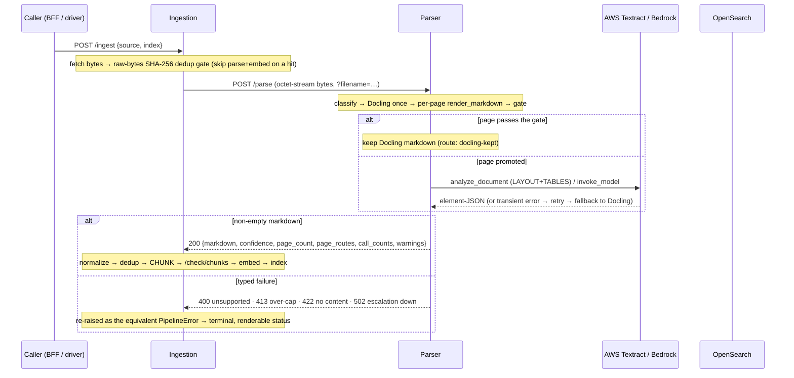

# Parser Service — topology

**Status:** as-built · **Scope:** how the parser sits between the other services, who calls it, and where
the parser / guardrail split falls at ingest time. **Companion:**
[parser-service-overview.md](parser-service-overview.md) · contract [parser-openapi.yaml](parser-openapi.yaml)
(internal, east-west)

The parser has exactly **one caller**: the **ingestion** service, at ingest time. It is not
end-user-facing and has no BFF surface — an officer never calls it, and there is no
`parser-api.yaml` twin (unlike the guardrail, which exposes a document-verdict surface to the BFF). The
parser is reached **only** from inside the mesh, over a location fact.

---

## 1. The services and their boundaries

Independent HTTP services, each with its own venv and a strict dependency firewall — **no service imports
another's Python.** Every parser call is HTTP-only over a URL.

| Service | Role | Talks to the parser via | Wire fact |
|---|---|---|---|
| **Ingestion** (`services/ingestion`) | `POST /ingest`: fetch → **parse** → normalize → dedup → chunk → guard → embed → index | `POST /parse`, `POST /parse/stream` | `INGESTION_PARSER_URL` |
| **Parser** (`services/parser`) | document bytes → clean Markdown + routing telemetry (Docling + Textract) | — (owns the heavy stack; calls AWS Textract / Bedrock) | — |
| **Guardrail** (`services/guardrail`) | verdict-only injection scan | — (does not call the parser) | ingestion calls it separately at `/check/chunks` |

Ingestion wires the parser exactly as it wires the guardrail: a URL, HTTP-only, **no import**. It routes
**every non-`.md` upload** through the parser (`.md` is already markdown); the parser owns the
`docling` + `torch` + `rapidocr` + `pypdfium2` stack so ingestion's venv and CI stay torch-free.

```
                          ┌─────────────────────────────┐
                          │        PARSER  (pod)         │
   ingest-time  ────────▶ │  Docling (CPU) · per-page    │ ───▶ AWS Textract (default)
   (ingestion)            │  gate · Textract/VLM escal.  │ ───▶ Bedrock Claude VLM (opt)
                          │  offline models · east-west  │
                          └─────────────────────────────┘
```

---

## 2. Ingest-time flow (ingestion → parser) — AS-BUILT

A document is submitted; ingestion routes its bytes to the parser, which returns clean Markdown (or a
typed failure), and only then does ingestion normalize, dedup, chunk, guard, and index.

**Ordered pipeline (`/ingest`):**

```
fetch → raw-bytes dedup gate → PARSE (parser: /parse → markdown) → normalize → dedup → chunk
      → /check/chunks (guardrail) → embed → bulk index → prune
```

Two ordering facts matter:

- The **raw-bytes SHA-256 dedup gate runs BEFORE the parser round-trip.** An identical re-upload
  short-circuits on a cheap OpenSearch lookup and **never pays for Docling/Textract again** — this is
  what bounds re-upload cost. (It keys on *raw input bytes*, so it does not suppress the one-time
  re-ingest when the extraction method itself changes.)
- The parser round-trip happens **before** chunking and the guardrail scan. The parser produces the
  markdown the chunker splits and the guardrail later scans; the two are sequential, independent seams.



**Failure mapping at the seam (ingestion's `parser_client`):** the parser's typed `400/413/422/502` are
re-raised as the equivalent ingestion `PipelineError`, so a document reaches a **terminal, renderable
failure** instead of an opaque 500. A network fault (parser killed / unreachable) is normalized to **502**
(retryable, never a hang); a **wedged** parse that stalls with no progress trips the httpx idle (`read=`)
timeout and surfaces as **504**; a stream that ends without a terminal frame is normalized to **502**.

---

## 3. Two call shapes: drain vs. stream

Both endpoints run the **same** `run_parse` generator under the **same** one-in-flight-per-pod semaphore.

| Shape | Endpoint | Used by | Behaviour |
|---|---|---|---|
| **Drain** | `POST /parse` | `parser_client.parse()` (blocking) | Runs to completion, returns only the terminal result. Phase events are ignored |
| **Stream** | `POST /parse/stream` | `parser_client.parse_stream(on_phase=…)` | Forwards each SSE frame; ingestion re-emits per-page progress through its own `/ingest/stream` (a nested stream) |

**No fabricated progress** end to end: the parser's `page` frames are a POST-HOC per-page manifest
(they arrive in a burst *after* the opaque Docling parse — the vendored pipeline exposes no page-level
callback), and ingestion forwards them verbatim. The honest consequence: on `/parse/stream` the largest
idle gap is the Docling parse itself, so the idle bound cannot distinguish a wedged parse from a
legitimately long one *during* that opaque span — an accepted v1 limitation of not forking the vendored
pipeline (the page cap × concurrency remains the hard spend/latency bound).

---

## 4. The parser / guardrail split (ingest-time)

The single most important boundary in the ingest flow — it decides what the guardrail's `/check/chunks`
scan can and cannot see:

> **By the time a document is markdown, the *visual-hiding* signal is gone.**

| Threat | Detectable after parse (in the markdown)? | Owner |
|---|---|---|
| Injected **content** (AI-directed instructions, jailbreaks, invisible Unicode that survived extraction) | **Yes** — it is text | **Guardrail** (`/check/chunks`) |
| **Visual hiding** (zero-size / transparent fonts, off-canvas, colour-hidden, metadata-only text) | **No — destroyed at parse** | **Parser** (text-layer-vs-OCR diff, per-span provenance) |

The parser is the natural owner of provenance because it **has the render layer**: a text-layer-vs-OCR
diff (extracted text that does not appear in an OCR of the rendered page is text a human never saw) and
per-span font/colour/position metadata. Today the parser *uses* the text layer only for the quality
gate's coverage check (`text_layer_tokens`); **surfacing per-span visual-hiding provenance alongside each
chunk is a future extension, NOT built.** A green `/check/chunks` therefore means *"no injected content in
the text,"* **not** *"no hidden text in the source."* The two halves are separate and composable, and
neither alone is a complete document-injection defence. See
[docs/guardrails/guardrail-topology.md](../guardrails/guardrail-topology.md) §5 for the guardrail side of
this same boundary.

---

## 5. Deployment shape

- **One uvicorn process per pod, one in-flight parse per pod.** `torch`/`docling` saturate the cores, so
  concurrency is bounded to 1 across *both* endpoints (a shared `asyncio.Semaphore`) and the blocking
  parse runs in a threadpool. **Scale horizontally by replicas.**
- **Offline image.** The Dockerfile bakes the Docling layout+table and rapidocr OCR models at build time
  (network on), then serves fully offline (`HF_HUB_OFFLINE=1` / `TRANSFORMERS_OFFLINE=1`). Verify with
  `scripts/run_offline_smoke.sh` (a network-blocked offline-startup smoke test). Base image is
  `python:3.11-slim` with `libgl1` + `libglib2.0-0` for opencv/onnxruntime.
- **No host port.** In compose the parser uses `expose:` only — reachable solely by other services on the
  internal network. This is the deliberate contrast with entry services that publish a host port. VPC +
  security groups are the prod equivalent.
- **AWS via the standard boto3 credential chain** (`ap-southeast-2` default). Textract needs
  `textract:AnalyzeDocument`; VLM escalation additionally needs Bedrock `InvokeModel`. Cost attribution
  is via IAM role/resource tags at the account level (`invoke_model` takes no per-call tags).

---

## 6. Contract

| Consumer | Contract | Auth |
|---|---|---|
| Ingestion (in-mesh) | [parser-openapi.yaml](parser-openapi.yaml) — `POST /parse`, `POST /parse/stream`, `GET /healthz` | Network isolation / mTLS peer (no app-level auth) |

There is **no BFF / end-user contract** for the parser: it is internal-only, and its output reaches the
UI only *through* ingestion (as indexed chunks and per-page progress on `/ingest/stream`). The parser's
route vocabulary and confidence are telemetry for ingestion and operators, not an end-user surface.
