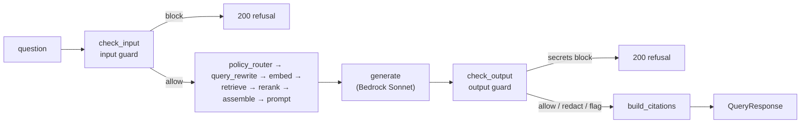
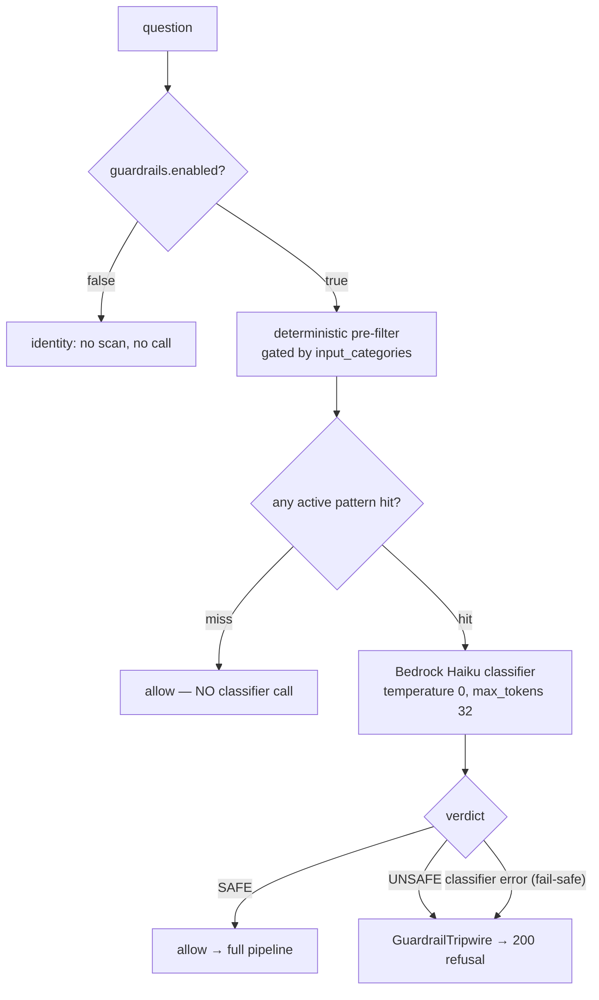
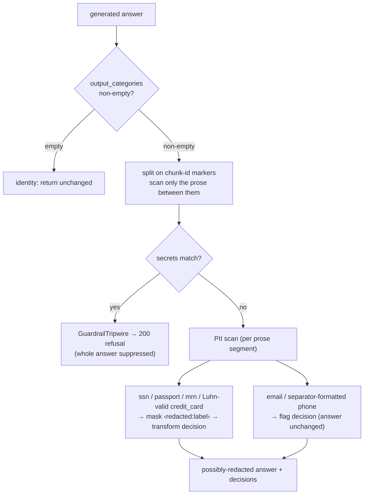
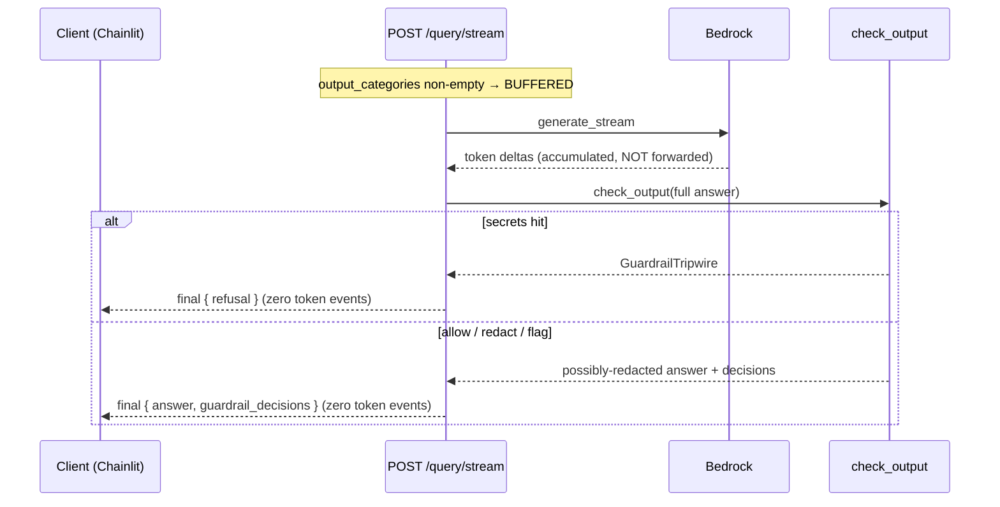

# Guardrails — orchestrator design

How the orchestrator's two guardrails work: a config-gated **input guard**
(system-prompt-leakage + jailbreak + unicode-evasion) that refuses before any
paid call, and a **deterministic output guard** (secrets → refuse, PII →
redact/flag) that scans the generated answer. Both are **pure functions**,
gated entirely by the pinned pipeline config.

> Roadmap: input guard = Phase 3 item 9 + the input side of item 11; output
> guard = item 10 + the output side of item 11.

---

## At a glance

| | Input guard (`check_input`) | Output guard (`check_output`) |
|---|---|---|
| Runs on | the user **question** (first stage) | the model's **answer** (post-generation) |
| Detects | prompt-leak / jailbreak / unicode evasion | **secrets** + **PII** |
| Mechanism | regex pre-filter → **Bedrock Haiku** classifier | **pure regex, no model call** |
| On a hit | 200 canned refusal, **before** retrieval/generation | secrets → refusal; PII → redact / flag |
| Gate | `guardrails.enabled` (+ pinned classifier) | `guardrails.output_categories` (alone) |
| Cost on normal traffic | ≈ 0 (classifier only on a pre-filter hit) | ≈ 0 (regex only) |

Both refuse by raising `GuardrailTripwire`
([guardrails.py:324](../app/orchestrator/guardrails.py#L324)), which the router
turns into an honest **200** response — never a 5xx.

---

## Where the guards sit in the pipeline

The input guard is **first** ([query.py `_run_pre_generation`](../app/routers/query.py#L213)),
so a block short-circuits *before* retrieval and generation. The output guard is
**last** ([query.py:467 `post_query`](../app/routers/query.py#L467)), so it only
ever sees text the model already produced — an output block therefore still
records a `generation` span, unlike an input block.

---

## 1. Input guard

A cheap deterministic pre-filter decides whether a question is worth
classifying. On normal traffic it misses, costs ≈ 0, and the question passes
through untouched. Only a flagged candidate reaches the paid Haiku classifier,
which makes the actual block/allow call.

**Pre-filter classes** (each gated by membership in `input_categories`, so a
config activates only the classes it lists):

- **`prompt_leak`** — the shipped keyword set (`_PREFILTER_PATTERNS`): "system
  prompt", "ignore previous", "reveal your instructions", …
- **`jailbreak`** — `_JAILBREAK_PATTERNS`
  ([guardrails.py:291](../app/orchestrator/guardrails.py#L291)): DAN, dev/god
  mode, `[SYSTEM]` / `<|im_start|>` token smuggling, instruction override.
- **`unicode_evasion`** — strips zero-width / invisible codepoints (`_INVISIBLE`)
  **before** matching so `ig​nore` no longer bypasses, and treats a BIDI override
  (`_BIDI`, e.g. U+202E) as a standalone hit.

**Classifier** ([clients/guardrail.py `GuardClassifier`](../app/clients/guardrail.py#L136)):
one deterministic Bedrock Haiku call, injected into the pure stage via a
`typing.Protocol` so the stage never imports boto3. **Fail-safe**: any classifier
error on an already-flagged input → block (never leak); a *misconfiguration*
(enabled but no classifier wired) is a loud 500, never a silent refusal.

**Block** ([check_input](../app/orchestrator/guardrails.py#L546)) →
`GuardrailTripwire` carrying `GuardrailDecision(stage="input", decision="block",
category="prompt_leak", rule_id="prompt-leak-v1")` and the canned `REFUSAL_TEXT`.

---

## 2. Output guard

Pure regex over the generated answer ([check_output](../app/orchestrator/guardrails.py#L618)),
gated by `output_categories` **alone** — it has no model dependency, so it runs
independently of `enabled` / the input classifier.

**Three actions:**

- **secrets → BLOCK.** Vendor-prefixed keys (`AKIA…`, `sk-ant-…`, `ghp_…`,
  `AIza…`, `xox…`, `hf_…`), private-key headers, JWTs, credential DB URLs
  (`_SECRET_PATTERNS`). A hit suppresses the **whole** answer to the canned
  refusal (`rule_id="output-secrets-v1"`).
- **PII redactable → TRANSFORM.** `ssn`, `passport`, `mrn`, and **Luhn-valid**
  `credit_card` are masked in place with a fixed `‹redacted:label›` token; one
  `transform` decision carries a per-rule count (`output-pii-redact-v1`).
- **PII advisory → FLAG.** `email` and separator-formatted `phone` are left
  intact (often legitimate) and recorded as one `flag` decision
  (`output-pii-flag-v1`).

**Three precision guards** (deterministic, chosen for a legal corpus full of
long digit strings):

1. **Marker-skip** — both scans operate only on prose **between** `[chunk_id]`
   citation markers (`_split_citation_markers`
   [guardrails.py:477](../app/orchestrator/guardrails.py#L477)). A chunk id is
   machine-generated, not model prose, so a card- or secret-shaped id never
   corrupts a citation (redaction is offset-preserving, so `claim_span` offsets
   stay valid) and never triggers a false block.
2. **Luhn gate** — `credit_card` masks only Luhn-valid numbers (`_luhn_ok`
   [guardrails.py:424](../app/orchestrator/guardrails.py#L424)); a 16-digit
   reference / control number is left intact.
3. **Phone separator** — `phone` flags only numbers with a real separator or
   parenthesized area code; a bare 10-digit run (a matter/reference number) does
   not.

---

## 3. Streaming: buffered vs. live

The output guard must see the **whole** answer before any of it is safe to show.
So when it's enabled, `POST /query/stream` **buffers**: it suppresses token
events, scans the complete answer, then emits exactly one `final`. This is the
only form that can guarantee "no secret byte reaches the user" — any live scheme
commits bytes before it has seen the full answer.

When `output_categories` is empty, the guard is a typed identity and tokens
stream **live** as generated. The buffered path reuses the exact zero-token /
one-`final` emission the input-guard block already uses, which Chainlit renders
via its `not streamed_any` branch.

---

## 4. Config surface

All guardrail behaviour is switched by the `guardrails` block of the pinned
pipeline config — environment variables never change behaviour. `GuardrailsPin`
([pipeline_config.py:235](../app/schemas/pipeline_config.py#L235)):

| Field | Effect |
|---|---|
| `enabled` | Master switch for the **input** guard. `false` ⇒ `check_input` is an identity (no pre-filter, no classifier call). |
| `classifier_model_id` | Bedrock Haiku model id for the input classifier; required (validated) when `enabled` is true. |
| `input_categories` | Active input classes — any of `prompt_leak`, `jailbreak`, `unicode_evasion`. Extensible tuple; empty ⇒ no pre-filter class fires. |
| `output_categories` | Active output classes — any of `pii`, `secrets`. The **sole** gate for the output guard: it is pure regex with no model dependency, so it runs independently of `enabled`. Empty ⇒ `check_output` is an identity and streaming stays live. |

Each category tuple is opt-in, so a config activates exactly the classes it
lists. The config value participates in `config_sha256`, so an identical hash
means identical guardrail behaviour. The guard-enabled config shipped as the
Chainlit default
([legal-rag-default-1.4.0.yaml](../app/configs/legal-rag-default-1.4.0.yaml))
sets `enabled: true`, all three input classes, and `output_categories: [pii,
secrets]`.

---

## 5. Decisions & observability

Every outcome is first-class data in `QueryResponse.guardrail_decisions`
([envelope.py:22 `GuardrailDecision`](../app/schemas/envelope.py#L22)) — the
field, route, and shape are unchanged (only the runtime values), so
`openapi.json` needs no regeneration.

| Guard | span | key attributes |
|---|---|---|
| input | `guardrail_input` (LLM) — only when the classifier runs | `guardrail.decision`, `.category`, `.rule_id`, model id + token counts |
| output | `guardrail_output` (CHAIN) — when `output_categories` non-empty | `guardrail.decision`, `.category`, `.rule_id`, `.count` (no model/tokens) |

Helpers: `start_guardrail_input_span`
([observability.py:326](../app/observability.py#L326)),
`start_guardrail_output_span`
([observability.py:380](../app/observability.py#L380)). Both are no-ops under the
no-op tracer.

**Three refusal sources produce distinct traces** — useful when reading Phoenix:

| Source | `guardrail_decisions` | retrieval/generation spans | block span |
|---|---|---|---|
| Input guard | `[{stage:"input", decision:"block"}]` | **absent** (short-circuit) | `guardrail_input` |
| Output secrets guard | `[{stage:"output", decision:"block"}]` | present | `guardrail_output` |
| Model self-refusal (model declines to emit) | `[]` | present | none |

---

## 6. Invariants

- **A tripwire is a 200, never a 5xx.** Both guards refuse by raising
  `GuardrailTripwire`; the router catches it and returns an honest 200 with a
  populated `guardrail_decisions`. It never reaches the error handlers.
- **Cost ≈ 0 on normal traffic.** Pre-filter and output scan are pure regex; the
  paid Haiku classifier runs only on a flagged input.
- **The stage stays pure.** `guardrails.py` imports no boto3 / OpenSearch /
  OpenTelemetry — enforced by the `stages-pure` import-linter contract and the
  grep-gate. The classifier is injected via a `Protocol`; spans live in the
  router.
- **Fail safe, not open.** Classifier error on a flagged input → block; a
  misconfigured guard → loud 500.
- **Config-attributable & deterministic.** Fixed pattern tables, fixed mask
  token, temperature 0 → identical config + identical answer ⇒ identical result,
  attributable to the pinned `config_sha256`.

---

## 7. Code map

| Concern | Location |
|---|---|
| Input guard stage | [guardrails.py `check_input`](../app/orchestrator/guardrails.py#L546) |
| Output guard stage | [guardrails.py `check_output`](../app/orchestrator/guardrails.py#L618) |
| Pre-filter (category-gated) | [guardrails.py `_prefilter_hit`](../app/orchestrator/guardrails.py#L499) |
| Marker-skip / Luhn helpers | [`_split_citation_markers`](../app/orchestrator/guardrails.py#L477), [`_luhn_ok`](../app/orchestrator/guardrails.py#L424) |
| Tripwire + refusal text | [guardrails.py:324](../app/orchestrator/guardrails.py#L324), [:39](../app/orchestrator/guardrails.py#L39) |
| Haiku classifier client | [clients/guardrail.py](../app/clients/guardrail.py#L136) |
| Router wiring (both routes) | [query.py `post_query`](../app/routers/query.py#L467), [`post_query_stream`](../app/routers/query.py#L718) |
| Output-guard gate | [query.py `_output_guard_active`](../app/routers/query.py#L141) |
| Spans | [observability.py:326](../app/observability.py#L326), [:380](../app/observability.py#L380) |
| Config schema | [pipeline_config.py `GuardrailsPin`](../app/schemas/pipeline_config.py#L235) |
| Decision envelope | [envelope.py `GuardrailDecision`](../app/schemas/envelope.py#L22) |
| Manual demo script | [demo_ui/TEST_QUESTIONS.md](../demo_ui/TEST_QUESTIONS.md) |

---

## 8. Out of scope (tracked follow-ups)

- LLM-based output classification (toxicity / topic / bias); homoglyph
  confusables; entropy / password heuristics.
- Input-side PII detection (the output guard only prevents PII/secrets in the
  *answer*, not the *question*).
- Indirect prompt injection via retrieved chunks — only partially mitigated; a
  poisoned chunk is caught by the output guard only if it yields a scanned
  pattern.
- The full `guardrails_active` decision badge in Chainlit (only the honest
  redaction/flag note is rendered today).
- Amazon Bedrock managed Guardrails (`ApplyGuardrail`); the in-house Haiku
  classifier fills the same seam.

> Provenance: the deterministic pattern tables were adapted from FutureAGI's
> `agent-learning-kit` scanners (`references/agent-learning-kit/python/fi/evals/guardrails/scanners/`)
> — tables only, reimplemented against this project's own types.
